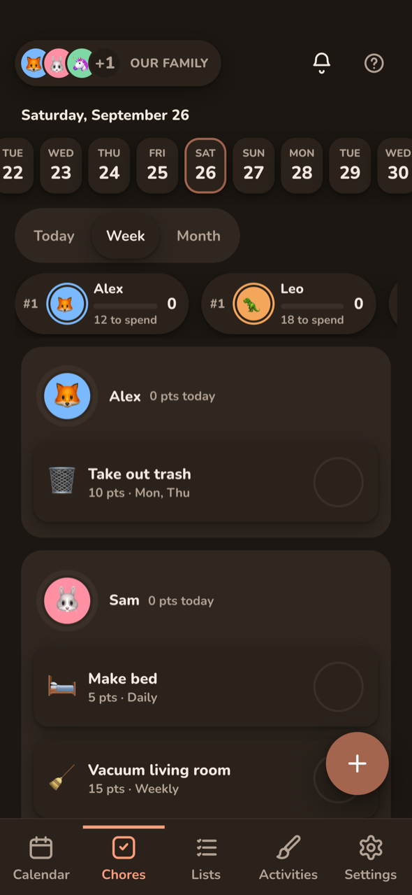

# Kinwall

Kinwall is an open-source, self-hosted family wall calendar, chore chart and shared list app, built for a wall-mounted iPad and just as handy on everyone's phone. It merges Google, Outlook, iCloud/CalDAV and ICS calendars into one color-coded view, gives each family member chores with points and streaks, and keeps the shopping list in sync. Everything it does is also available through a REST API, webhooks and an MCP server.


<p align="center">
  
  
  
</p>

## Features

- **One family calendar**: Google, Microsoft 365 / Outlook, iCloud and CalDAV (two-way), and any ICS feed (read-only), color-coded by person.
- **Views for every screen**: Week, Day, Month and Schedule on the wall. Week becomes a 3-day view on phones. Swipe to page, and it returns to today when idle.
- **Events that help**: reminders written through to Google and Outlook, travel time with a leave-by time, map links, and tasks linked from your lists.
- **Categories**: 🎂 Birthdays, 🏥 Appointments and more, auto-matched by keyword, with a multi-select filter.
- **Daily & weekly snapshot**: tap someone's avatar for their day: a greeting, the weather, their events and leave-by times, chores, due and important list items, birthdays 🎂, and tomorrow at a glance, or flip to their week.
- **Chores**: one-off or recurring, points, streaks with grace days, late-completion credit and an optional leaderboard.
- **Lists**: shopping, to-do and reusable lists. Items remember their store and category, and you can drag to reorder.
- **Activities**: a kids' Paint app with a rainbow brush, fill bucket and undo. Drawings stay on the device and can be saved to Photos or printed.
  - **Sticker book**: kids spend chore points on emoji sticker packs and decorate their own scrapbook page.
- **Push notifications**: per-device event reminders, a morning summary, chore nudges and list updates, all also kept in an in-app notification feed behind the header bell.
- **Made for the wall**: display pairing by code or QR, quiet hours with a dim clock overnight, per-device appearance, dark mode on a schedule.
- **Secure by default**: passkeys, recovery codes, scoped keys, and credentials encrypted at rest.

## Deploy

**Docker** (amd64/arm64):

```bash
docker run -d --name kinwall -p 8080:8080 -v ./data:/data \
  -e PUBLIC_URL=http://<your-server>:8080 ghcr.io/johnduprey/kinwall
```

**Cloudflare Workers** (free tier, HTTPS included), from a clone with Node 24:

```bash
node scripts/setup-cloudflare.mjs
```

There's also a [Home Assistant add-on](https://github.com/JohnDuprey/kinwall-homeassistant). A hosted version of Kinwall is coming soon.

The setup wizard, putting it on the wall, connecting calendars, every setting and environment variable, backups and troubleshooting are all in the **[documentation](https://docs.kinwall.family)** (also in [`docs/`](docs/README.md)).

## Integrations

- **REST API**: everything the UI does, with Swagger docs at `/docs` and the spec at `/openapi.json`. See [docs](docs/integrations/rest-api.md).
- **Webhooks**: 12 HMAC-signed event types for automations. See [docs](docs/integrations/webhooks.md).
- **MCP server**: connect Claude or any MCP client at `/mcp` with OAuth sign-in or a bearer key. See [docs](docs/integrations/mcp.md).
- **Home Assistant**: integration and add-on in [kinwall-homeassistant](https://github.com/JohnDuprey/kinwall-homeassistant).

## Your data

Download everything your family entered as one JSON file and import it into another Kinwall. Logins stay out of the file, and synced calendars reconnect with their settings intact. See [Export & import](docs/your-data/export-import.md).

## Built with Claude

Kinwall is built by John Duprey with [Claude Code](https://claude.com/claude-code).

## Support the project

Kinwall is free and self-hostable. If it's on your wall, [sponsoring on GitHub](https://github.com/sponsors/JohnDuprey) helps keep it that way.

## License

AGPL-3.0-or-later. See [LICENSE](LICENSE).
