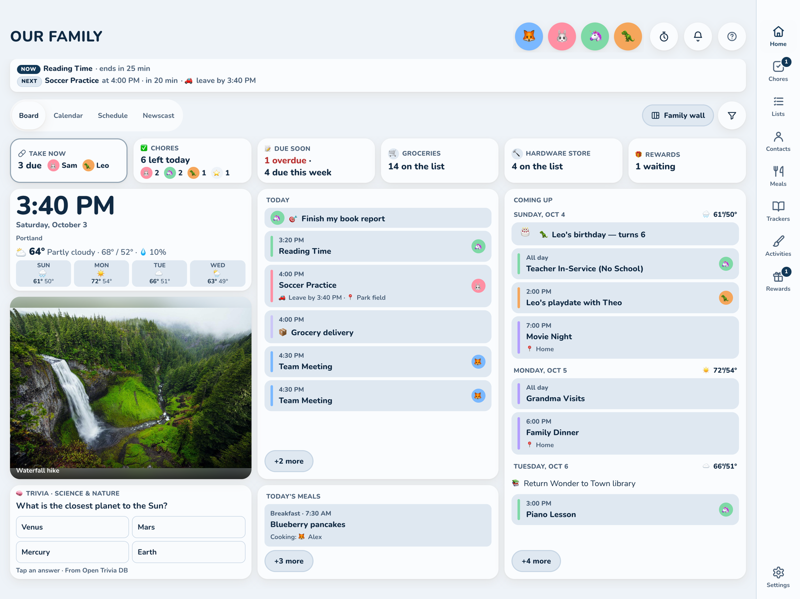
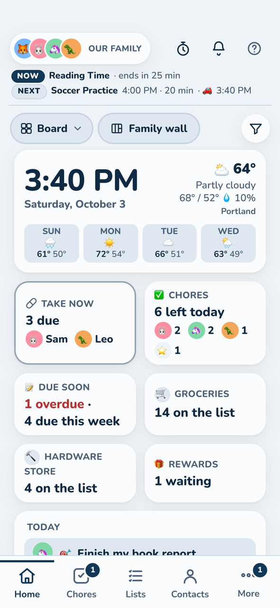
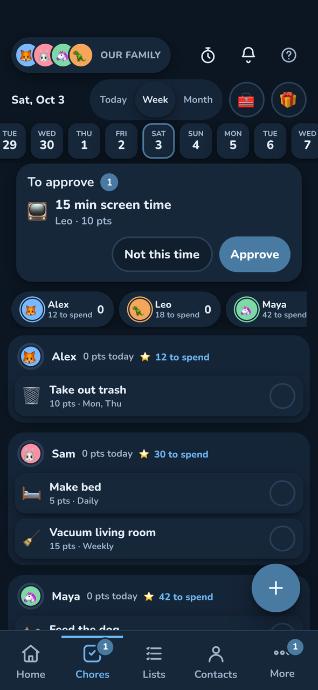

# Kinwall

**The family life organizer, on your wall and every phone.** Your whole family, on the same page.

Kinwall keeps the household's moving parts in one calm place: calendars, chores, lists, meals, routines, medicines, contacts and memories. A tablet on the wall shows the day at a glance from across the room, every phone carries the same thing, and kids can check off their own chores and routines. It's not one more app for one busy grown-up; it's where the whole family keeps its plans, so nobody has to carry it all in their head.

Kinwall is built with neurodivergent family members in mind, and it's free, open source (AGPL) and self-hosted: your family's data lives on your own server, with no ads and no tracking. Every feature is in this repo.

**[Try the live demo](https://demo.kinwall.family)** (it runs in your browser with a sample family; nothing is saved) or [run it yourself](#deploy).



<p align="center">
  
  
  
</p>

## What lives in Kinwall

Use all of it or just a few parts. Turn off what you don't use (chores, lists, meals, contacts, Paint, photos, notes, messages, any tracker) and it disappears from every screen.

- **The Board**: the first thing every screen shows, readable from across the room: a big clock, the weather and the next four days, today, coming up, chores, lists, meals, a family photo and a card with a quote, fun fact, "On this day", trivia or tip. Each screen can have its own layout, big and simple for the kids or meals first in the kitchen.
- **Calendar**: Google, Microsoft 365 / Outlook and iCloud / CalDAV (two-way) and any ICS feed (read-only), merged and color-coded by person. Day, Week, Month and Schedule views, with 3 Day on phones. Events get reminders, a leave-by time for the drive, categories (🎂 Birthdays, 🏥 Appointments) and linked tasks. Filter a busy school or team calendar down to what matters, skip all-day noise, or hide one event or a whole series.
- **Someone's day**: tap an avatar for that person's day: their events and when to leave, chores to tick off, things due, birthdays and a peek at tomorrow, or flip to their week.
- **Chores and rewards**: one-off or recurring chores with points, streaks that survive an off day, partial credit for late, and an optional leaderboard. Checklists ("Bedtime: shower, pajamas, teeth"), activity chores ("5 min of Sight words") and, if you want it, a parent's OK before points count. Kids save up for rewards and fill a sticker book.
- **Lists**: Groceries, Shopping, To-dos and Reusable lists, shared live. Grocery and shopping items remember their store and aisle, and Shopping mode walks the store in order. To-dos have owners, due dates and steps; packing lists reset for next time.
- **Meals**: plan the week's breakfasts, lunches, dinners and snacks from a recipe library. Import a recipe from a link, scale servings, cook along with step timers, and send the week's ingredients to the grocery list without doubling up.
- **Routines and reminders**: a Now / Next strip with a live countdown, calm transition warnings before it's time to switch, push reminders, a morning summary and timers anyone can start from the header.
- **Medicines and health**: medication reminders with a Take now card on the wall, plus checkups, vaccines and measurements. Off until a parent turns it on, always encrypted, and shared screens say "Meds", not the medicine.
- **Contacts**: the household's people and places outside the family: the babysitter, grandparents, the school office, the pediatrician.
- **Memories and play**: a shared photo album for the Board, a reading log, a family memories journal, Paint with drawings saved to the album, and sandboxed learning games like [Sight words](https://github.com/JohnDuprey/kinwall-plugin-sight-words) and [Math practice](https://github.com/JohnDuprey/kinwall-plugin-math) (no internet, no family data). [Build your own](docs/contributing/plugins.md) from the [hello-world starter](https://github.com/JohnDuprey/kinwall-plugin-hello-world).
- **Check-ins**: an optional Temp check, energy battery and evening check-in, with a private journal and insights for each person.

## Made for kids, too

Kinwall is built to be used by kids, not just about them: no ads, no streak guilt, no dark patterns.

- **A device of their own**: pair a tablet as a kid's device and it shows only their events, chores and lists. Grown-up settings stay behind a parent's passkey.
- **Chores that forgive**: late still earns partial credit, a streak survives an off day, and kids can ask for a reward for a parent to OK.

## Built for brains that work differently

Designed with neurodivergent family members in mind, and aiming for WCAG 2.2 AA throughout. See [Accessibility](docs/accessibility.md).

- **Now and Next** with a countdown on every view, and calm **transition warnings** before the next thing or the leave-by time, on the wall and on that person's phone.
- **Low-stimulation mode**: flat, calm colors and no motion.
- **Type that fits**: seven bundled typefaces, including [Atkinson Hyperlegible Next](https://www.brailleinstitute.org/freefont/) and the dyslexia-friendly [Lexend](https://www.lexend.com), in four text sizes.
- **Color is never the only clue**: every color comes with a name, emoji or avatar, and Kinwall warns when two people's colors look alike to color-blind eyes.

## Made for the wall

- **Touch-first**: big targets, swipe between weeks, and it drifts back to today on its own. Pair a wall screen with a code or QR.
- **Rests at night**: during the night hours, walls dim to a drifting clock or a slideshow of family photos and drawings, and reminders wait until morning. See [Night](docs/using/night.md).
- **Your family's look**: seventeen color schemes checked for contrast (Eucalyptus is the default), a seasonal switch, or your own, in light and dark. The whole family can share one, or each screen picks its own.

## Private by design

- **On your own server**: your calendar, chores and photos live in a database you own. No ads, no tracking, no one else's cloud.
- **No accounts, no passwords**: parents sign in with a passkey. Wall screens and kids' tablets pair with a code and never see settings.
- **Health stays locked**: medicines and checkups are always encrypted, and stay out of webhooks and AI assistants unless you turn each one on.
- **Nothing held back**: every feature is in the open-source app. What you see in the demo is all of it.

## Deploy

**Docker** (amd64/arm64):

```bash
docker run -d --name kinwall -p 8080:8080 -v ./data:/data \
  -e PUBLIC_URL=http://<your-server>:8080 ghcr.io/johnduprey/kinwall
```

**Cloudflare Workers** (free tier, HTTPS included), from a clone with Node 24:

```bash
node scripts/setup-cloudflare.mjs
```

There's also a [Home Assistant add-on](https://github.com/JohnDuprey/kinwall-homeassistant).

The setup wizard, putting it on the wall, connecting calendars, every setting and environment variable, backups and troubleshooting are all in the **[documentation](https://docs.kinwall.family)** (also in [`docs/`](docs/README.md)).

## Integrations

- **REST API**: everything the UI does, with [Swagger UI](https://github.com/swagger-api/swagger-ui) docs at `/docs` and the spec at `/openapi.json`. See [docs](docs/integrations/rest-api.md).
- **Webhooks**: HMAC-signed event types for automations. See [docs](docs/integrations/webhooks.md).
- **MCP server**: connect Claude or any MCP client at `/mcp` with OAuth sign-in or a bearer key. See [docs](docs/integrations/mcp.md).
- **Home Assistant**: calendars, to-do lists, points sensors and a binary sensor per chore, plus an add-on to run Kinwall itself, in [kinwall-homeassistant](https://github.com/JohnDuprey/kinwall-homeassistant). See [docs](docs/integrations/home-assistant.md).
- **[n8n](https://n8n.io)**: example workflows with n8n's built-in HTTP Request and Webhook nodes. See [docs](docs/integrations/n8n.md).

## Your data

Download everything your family entered as one JSON file and import it into another Kinwall. Logins stay out of the file, and synced calendars reconnect with their settings intact. Family photos back up as their own zip. See [Export & import](docs/your-data/export-import.md).

## Built with Claude

Kinwall is built by John Duprey with [Claude Code](https://claude.com/claude-code), with UI/UX design decisions by Ashley Duprey.

## Support the project

Kinwall is free and self-hostable. If it's on your wall, [sponsoring on GitHub](https://github.com/sponsors/JohnDuprey) helps keep it that way.

## License

AGPL-3.0-or-later. See [LICENSE](LICENSE). The bundled typefaces in `web/src/fonts/` are under the SIL Open Font License 1.1; each folder holds its `OFL.txt`.

Kinwall stands on a lot of open-source work and open data. [Credits](docs/contributing/credits.md) lists the projects, typefaces and data sources it uses, with their authors and licenses.
