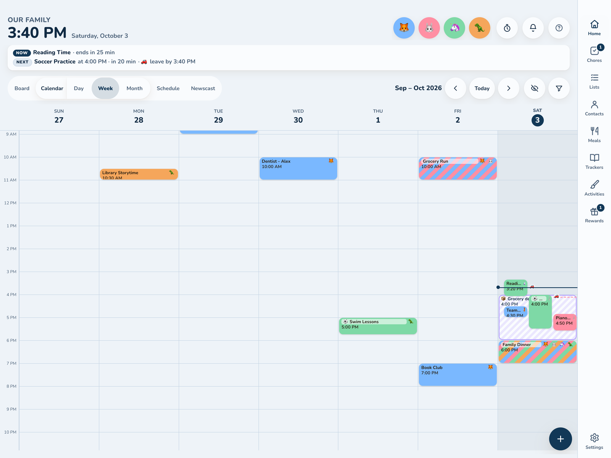

# Kinwall

**The family life organizer, on your wall and every phone.**

Kinwall keeps the household's moving parts in one calm place: calendars, chores, lists, meals, routines, medicines, contacts and memories. A tablet on the wall shows the day at a glance from across the room, every phone carries the same thing, and kids can check off their own chores and routines. It's built with neurodivergent family members in mind, and it's free, open source and self-hosted, so your family's data stays on your own server.

| | |
|---|---|
|  |  |
|  |  |

## Where to start

* **New here?** Read [What is Kinwall](getting-started/what-is-kinwall.md).
* **Want it running in five minutes?** [Quick start (Docker)](getting-started/quick-start-docker.md) or [Deploy to Cloudflare Workers](getting-started/deploy-cloudflare.md) (free tier, HTTPS included).
* **Already run Home Assistant?** Use the [Home Assistant add-on](getting-started/home-assistant-add-on.md).
* **Just installed it?** Follow the [First-run setup wizard](getting-started/setup-wizard.md), then [Put it on the wall](getting-started/put-it-on-the-wall.md).
* **Connecting calendars?** Start with [Google](calendars/google.md), [Microsoft / Outlook](calendars/microsoft.md), [iCloud & CalDAV](calendars/icloud-caldav.md) or [ICS feeds](calendars/ics-feeds.md).
* **Building a learning game?** See [Building activity plugins](contributing/plugins.md) and start from the [hello-world starter](https://github.com/JohnDuprey/kinwall-plugin-hello-world).
* **Automating things?** See the [REST API](integrations/rest-api.md), [Webhooks](integrations/webhooks.md) and the [MCP server](integrations/mcp.md) for AI assistants.

Just want a look first? The [live demo](https://demo.kinwall.family) runs entirely in your browser with a sample family, and nothing is saved. To build it yourself, see [Demo build](self-hosting/demo-build.md).

Kinwall stands on a lot of open-source work; see [Credits](contributing/credits.md).
