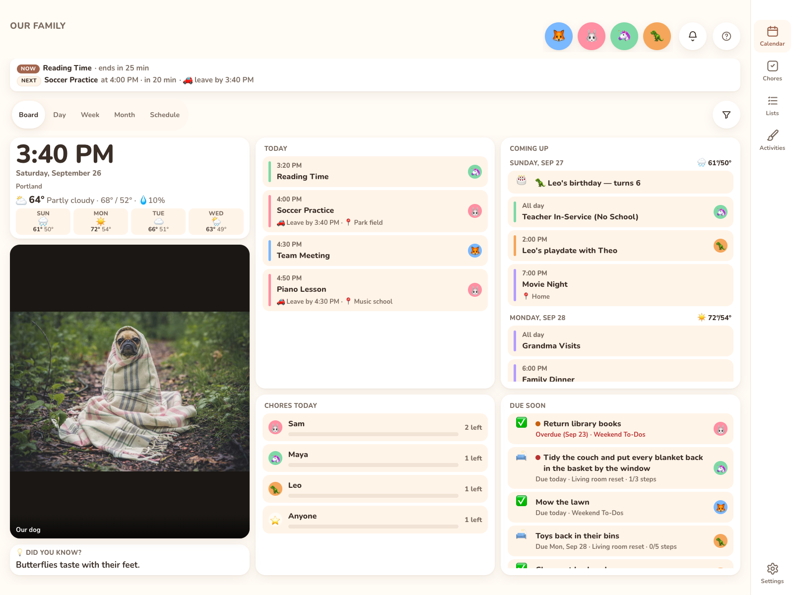

# Put it on the wall

## 1. Pair the display

1. On the iPad, open `https://<your-kinwall>` in Safari and tap **Set up as a wall display**. It shows **Set up this display** with a 6-digit code and a QR code. The code is valid for 10 minutes.
2. Approve it from an admin device, either way:
   * scan the QR code with your phone and approve with your passkey, or
   * on your phone or computer, open **Settings → Access → Displays → Add a display**, then enter the **Code** and a **Name** (default "Wall display") and tap **Pair display**.

   Either way you also pick who it **Belongs to**: **Shared (the whole family)** for a kitchen wall, or one member (say Maya, for her bedroom) to show only their things. Only an admin can change it later, under **Settings → Access → Displays**.
3. The display shows "You're connected! 🎉" and loads the calendar. It now holds a **display** key, which can't manage members, accounts, keys or webhooks.

You can also tap **Enter a key manually** on the sign-in screen and paste any API key.

## 2. Install it as an app (PWA)

In Safari, tap **Share → Add to Home Screen**, then always launch Kinwall from the home screen icon. It runs full screen with no browser bars. On Android, Chrome's **Install app** / **Add to Home screen** does the same.

On phones, Kinwall also offers this itself. From the second visit in a browser, a card above the tab bar says **Add Kinwall to your Home Screen**. On Android its **Install** button opens the install dialog; on iPhone and iPad **Show me how** walks through Share → **Add to Home Screen**. **Not now** hides it for 30 days, and it never shows once Kinwall runs from the Home Screen. The same option is always under **Settings → General → This display → Add to Home Screen**.

### Requirements

| | To run Kinwall | To add it to the Home Screen | Push notifications |
|---|---|---|---|
| **iPhone / iPad** | iOS / iPadOS **16.4 or later** | **Safari**: Share → **Add to Home Screen**. Chrome and Edge also offer it from their Share button. | Only from the Home Screen icon, iOS / iPadOS 16.4 or later |
| **Android** | A current **Chrome**, **Edge**, **Samsung Internet** or **Firefox** | Chrome, Edge or Samsung Internet: **Install app** / **Add to Home screen** (or Kinwall's own **Install** button) | In the browser or installed |
| **Computer** | Chrome or Edge 111+, Firefox 114+, Safari 16.4+ | Optional: the install icon in Chrome's or Edge's address bar | Any browser with Web Push |

The web app is built for those browser versions. On anything older (an iPad that can't update past iPadOS 15, say) Kinwall isn't supported and may show a blank page, so update the browser or the device.

### Installed vs. in the browser

Installing changes how Kinwall opens, not what it can do. Everything (calendar, events, chores, lists, photos, Paint, settings, the notification bell) works the same in a browser tab. Only these differ:

| | From the Home Screen | In a browser tab |
|---|---|---|
| Screen | Full screen with its own icon, no address bar or tabs | Browser bars and tabs stay visible |
| Push notifications on iPhone / iPad | Yes (iOS 16.4+) | No. Safari tabs can't receive push; the [notification feed](../using/notifications.md#notification-feed) under the bell still shows everything. |
| Push notifications on Android and computers | Yes | Yes |
| The **Add Kinwall to your Home Screen** card | Never shown | Shown on phones from the second visit |

In both cases Kinwall asks the browser to keep the screen awake while it's showing. Browsers without that feature let the screen sleep, so on a wall iPad set **Auto-Lock → Never** (below) either way.

Kinwall needs a connection to your server whether it's installed or not. It doesn't keep an offline copy.

## 3. Lock the iPad to Kinwall

* **Settings → Display & Brightness → Auto-Lock → Never**.
* **Settings → Accessibility → Guided Access → On**. Open Kinwall and triple-click the side/top button to start it. This keeps the iPad on Kinwall and disables the home gesture.
* Optional: turn on [Quiet hours](../using/quiet-hours.md) so the screen shows only a dim clock overnight.

## How the wall display behaves

* After 2 minutes without a touch it goes back to today's calendar and closes any open sheet.
* It checks for changes every 30 seconds (`GET /api/rev`), so edits from phones show up within about 30 seconds.
* When a new version is deployed, a **Kinwall updated — tap to reload** banner appears.
* **Settings** on a display shows **General** (the family cards and this device's cards) and **Family** (Members read-only, Categories). The **Calendars** and **Access** tabs are hidden. See [This display](../settings/this-display.md).

## Unpair or replace a display

* On the display: **Settings → General → Troubleshooting → Unpair this display**.
* From an admin device: **Settings → Access → Displays**, then remove the display. It's signed out at once and needs pairing again.
