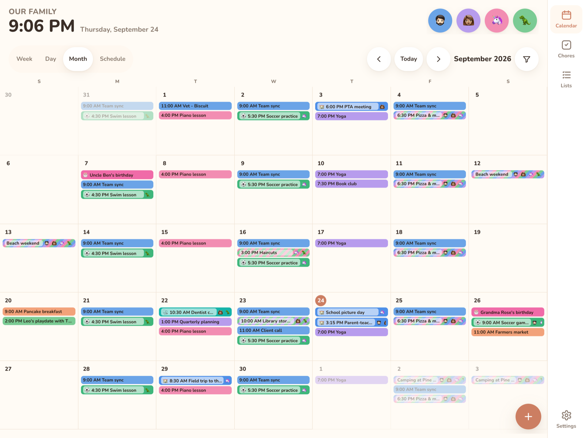

# What is Kinwall

Kinwall is a family calendar, chore chart and list app you host yourself. The main screen is a touch-first calendar meant to hang on the wall (usually an iPad in Guided Access). Everyone else uses the same app on their phone.

## What it does

| Area | In short | Read more |
|---|---|---|
| Calendar | Week, Day, Month and Schedule views. On phones the week becomes a 3-day view. Colour-coded by family member or category. | [Calendar](../using/calendar.md) |
| Events | Create and edit events. Changes go back to Google, Outlook and CalDAV. You can add reminders, a travel time with a leave-by time, members, a category and linked tasks. | [Events](../using/events.md) |
| Calendars | Google, Microsoft 365 / Outlook, iCloud and other CalDAV servers, and any ICS URL. | [Connecting calendars](../calendars/google.md) |
| Chores | One-off or recurring chores with points, streaks and a leaderboard. | [Chores](../using/chores.md) |
| Lists | Shopping, to-do and reusable lists. Items remember their store and category. | [Lists](../using/lists.md) |
| Notifications | Web Push reminders, a daily summary, chore nudges and list updates, set per device. | [Notifications](../using/notifications.md) |
| Automation | REST API with OpenAPI docs, signed webhooks, an MCP server for AI assistants, and a Home Assistant integration. | [Integrations](../integrations/rest-api.md) |

## How it runs

The same code runs in three places:

* **Cloudflare Workers**: fits the free tier, uses D1 as the database and comes with HTTPS. See [Deploy to Cloudflare Workers](deploy-cloudflare.md).
* **Docker** (amd64/arm64): a single container storing SQLite in `/data`. See [Quick start (Docker)](quick-start-docker.md).
* **Home Assistant add-on**: see [Home Assistant add-on](home-assistant-add-on.md).

A hosted version of Kinwall is coming soon. Until then, you run your own copy.

## Who can do what

Kinwall has no user accounts. Access comes from keys:

* **Admin**: a phone or computer signed in with a passkey (or an admin API key). It can do everything.
* **Display**: a paired wall screen. It can use the calendar, chores, lists and everyday settings, but can't manage members, calendar accounts, keys or webhooks.

For details, see [Sign-in & security](../using/sign-in-and-security.md).
