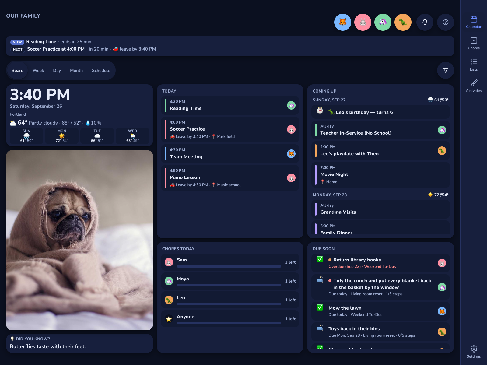
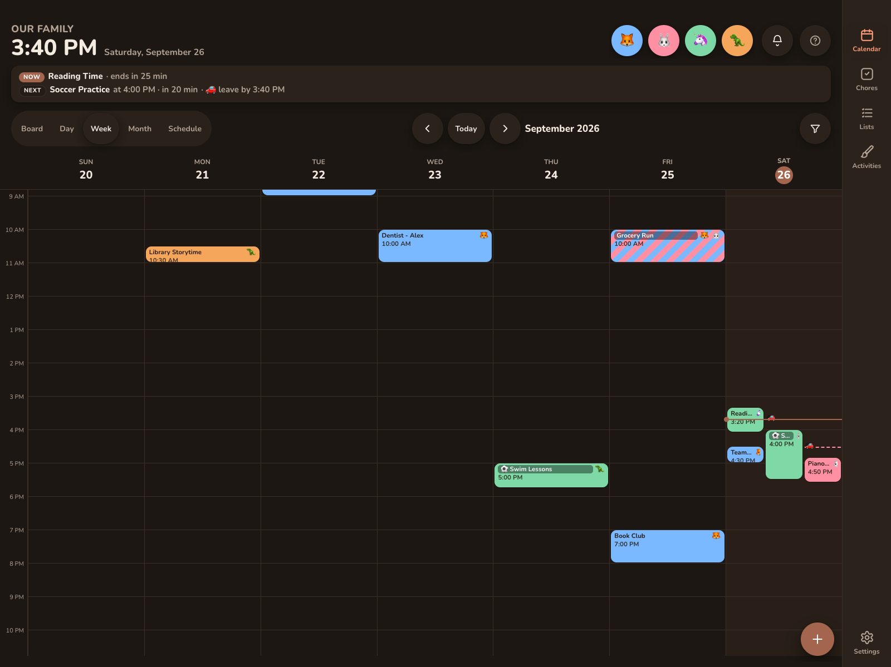

# Appearance

Appearance works on two levels:

* **Household**: **Settings → General → Appearance**. It applies to every device, and it's also used on the sign-in and pairing screens before a device has a key.
* **Per device**: **Settings → General → Appearance on this device**. It overrides the household value on this device only.

## Household settings

Quiet hours are a separate card, right after Appearance. See [Quiet hours](quiet-hours.md).

| Setting | Options | Default |
|---|---|---|
| **Mode** | Light, Dark, Auto (follows the device's system setting), Scheduled | Light |
| **Dark from / Dark to** (Scheduled) | Two times. The window can cross midnight. | 20:00 → 07:00 |
| **Color scheme** | Seasonal, one of ten skins, or one of the family's own schemes. See [Color schemes](#color-schemes). | Meadow |
| **Text size** | Small, Medium, Large, Extra large | Medium |
| **Density** | Comfortable, Compact (shorter hour rows in the time grid) | Comfortable |

Changes save as you make them, and other devices pick them up within about 30 seconds.

### Dark schedule

**Scheduled** switches to dark between **Dark from** and **Dark to** in the device's local time, and it re-checks every minute. It's a good fit for a wall display that should dim in the evening without going dark all day. **Auto** follows the operating system's light/dark setting instead.

## Per-device overrides

Under **Appearance on this device**:

* **Mode**, **Text size** and **Density** are menus. The first option is **Household (*current value*)**, which follows the family setting.
* **Color scheme** has the same chips as the household setting, plus a first chip, **Household · *scheme***, which follows the family setting. The family's own schemes are there too. See [Color schemes](#color-schemes).
* **Typeface**: Default (Nunito), Hyperlegible (Atkinson Hyperlegible Next) or Dyslexia-friendly (Lexend).
* **Low-stimulation mode**: a toggle that reduces motion and visual noise on this device.

Overrides are saved in the browser's local storage on that device. They're never sent to the server and aren't in exports. A kitchen iPad can use Extra large text and the Midnight scheme while phones stay on the household defaults.

**Navigation position** (Auto, Bottom, Left, Right) for tablets and desktops is in the **This display** card. Phones always use the bottom bar. See [This device](../settings/this-display.md).

## Color schemes

A color scheme (a "skin") changes the whole palette: backgrounds, cards, text and accent. The household picks one for every device under **Appearance**. Any device can follow it or pick its own under **Appearance on this device**, so the kitchen wall can use Midnight while phones keep the family's scheme.

**Color scheme** offers ten skins, each with its own light and dark palette:

| Skin | Notes |
|---|---|
| 🌿 Meadow | The default look. Nothing changes if you never touch this. |
| 🍂 Autumn, ❄️ Winter, 🌸 Spring, ☀️ Summer | The four seasons. |
| 🌊 Ocean, 💜 Lavender | |
| 🌌 Midnight | A deep navy that looks the same in light and dark mode. |
| 🎃 Harvest, 🎄 Festive | For the holidays. |

Every skin meets WCAG AA contrast (4.5:1) for text on its backgrounds.

**Seasonal** changes the scheme through the year for you:

* Winter: December to February
* Spring: March to May
* Summer: June to August
* Autumn: September to November
* Harvest takes over from November 15 to 30, and Festive from December 15 to January 2.

It checks once an hour, so it switches on the same day a season changes.

**Reset to Meadow** (household) sets the family back to the default look. **Use household colors** (device) sets the device back to following the family.

## Your own color schemes

Tap **Customize** under the scheme chips to make a scheme of your own. It starts as a copy of the scheme you're on, and opens in a sheet with both modes side by side:

* **Light mode** and **Dark mode** each have **Background**, **Cards**, **Text** and **Accent**, plus a live preview of a card.
* The softer background, borders and dim text are worked out from your colors.
* Each mode shows four contrast checks: text and dim text, on the background and on cards. **Save and use** stays off until every check reaches 4.5:1 in both modes, so a saved scheme is readable whatever the time of day. Accent buttons adjust themselves so their labels stay readable.

Give it a name and an emoji and save. The scheme is saved for the whole family and appears as a chip next to the built-in schemes on every device:

* Made from **Appearance**, it becomes the family's scheme.
* Made from **Appearance on this device**, only this device switches to it. Other devices can still pick it.

When a saved scheme is selected, **Edit *name*** reopens it, and **Duplicate** starts a new one from it. Deleting a scheme (in the sheet) moves any screen using it back to Meadow. A family can keep up to 10 schemes.

### Custom colors from an earlier version

Kinwall used to let you set single custom colors on top of a scheme, the same in light and dark mode. If you set any, a note under the scheme chips says so:

* **Save as a scheme** opens the editor with those colors in light mode and the scheme's own dark colors, so you can check both and save them as a scheme.
* **Remove them** goes back to the plain scheme.

Low-stimulation mode always uses the scheme's own backgrounds, cards and text, without any leftover custom colors from an earlier version.
