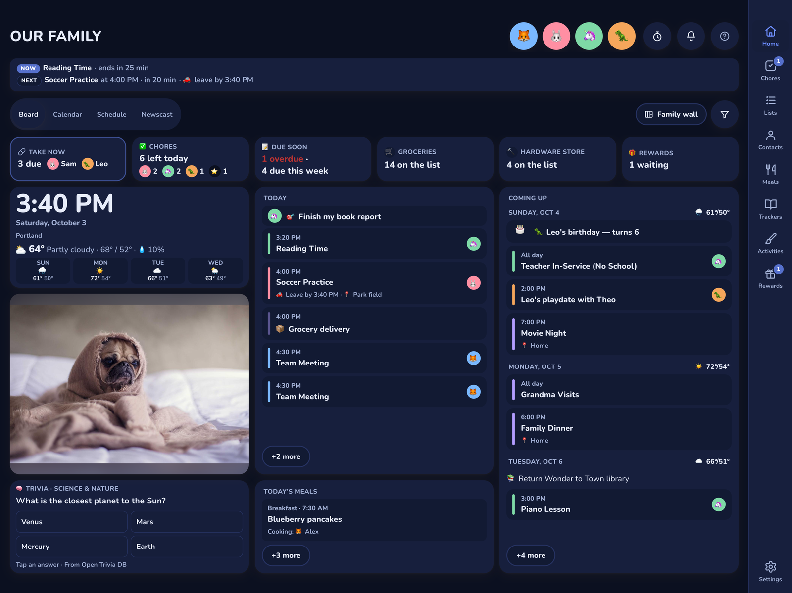
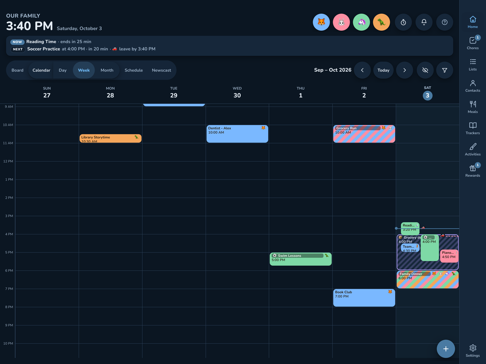
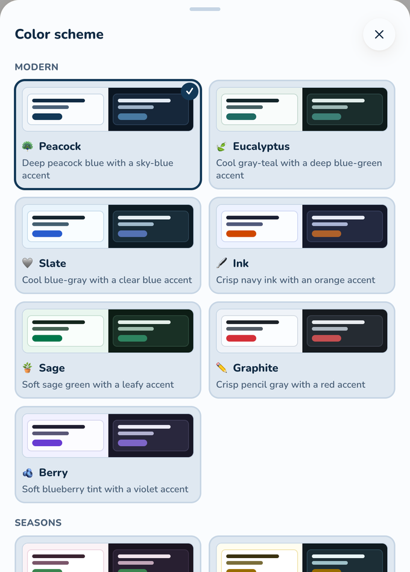
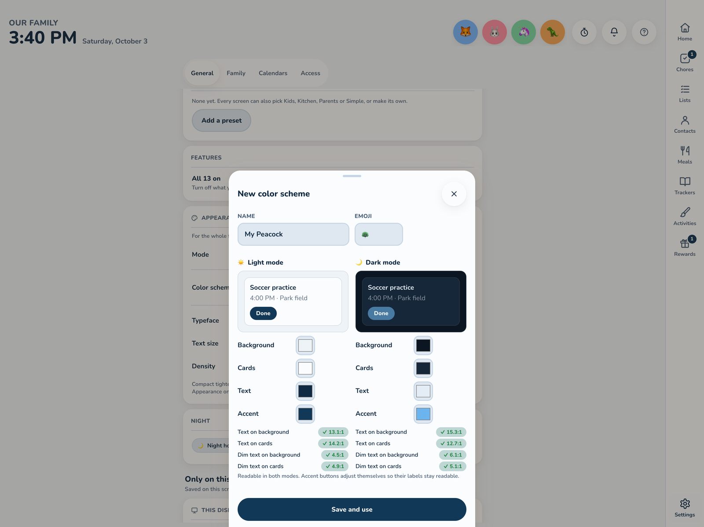

# Appearance

Appearance works on two levels:

* **Household**: **Settings → General → Appearance**. It applies to every device, and it's also used on the sign-in and pairing screens before a device has a key.
* **Per device**: **Settings → General**, tap **Change** under **Appearance on this device**. It overrides the household value on this device only.

## Household settings

Quiet hours are a separate card, right after Appearance. See [Quiet hours](quiet-hours.md).

| Setting | Options | Default |
|---|---|---|
| **Mode** | Light, Dark, Auto (follows the device's system setting), Scheduled | Auto |
| **Dark from / Dark to** (Scheduled) | Two times. The window can cross midnight. | 20:00 → 07:00 |
| **Color scheme** | Seasonal, one of sixteen skins, or one of the family's own schemes. See [Color schemes](#color-schemes). | Peach |
| **Typeface** | Default (Nunito), Hyperlegible, Dyslexia-friendly, Modern, Playful, Storybook or Handwritten. See [Typeface](#typeface). | Default (Nunito) |
| **Text size** | Small, Medium, Large, Extra large | Medium |
| **Density** | Comfortable, Compact (shorter hour rows in the time grid) | Comfortable |

Changes save as you make them, and other devices pick them up within about 30 seconds.

### Dark schedule

**Scheduled** switches to dark between **Dark from** and **Dark to** in the device's local time, and it re-checks every minute. It's a good fit for a wall display that should dim in the evening without going dark all day. **Auto** follows the operating system's light/dark setting instead.

## Per-device overrides

Under **Appearance on this device** (tap **Change**):

* **Mode**, **Text size** and **Density** are menus. The first option is **Household (*current value*)**, which follows the family setting.
* **Color scheme** opens the same sheet as the household setting, with **Use the family's scheme** first, which follows the family setting. The family's own schemes are there too. See [Color schemes](#color-schemes).
* **Typeface** opens the same sheet as the household setting, with **Use the family's typeface** first, which follows the family setting. While it does, the row reads **🏠 Household (*typeface*)**. See [Typeface](#typeface).
* **Low-stimulation mode**: a toggle that reduces motion and visual noise on this device.

**Reset this device's appearance**, at the bottom of the Color scheme sheet, puts mode, color scheme, text size, density, typeface and low-stimulation mode back to the family's settings on this device. It asks first.

Overrides are saved in the browser's local storage on that device. They're never sent to the server and aren't in exports. A kitchen iPad can use Extra large text and the Midnight scheme while phones stay on the household defaults.

**Navigation position** (Auto, Bottom, Left, Right) for tablets and desktops is in the **This display** card. Phones use the bottom bar, and a slim rail down the left side when turned sideways. See [This device](../settings/this-display.md).

## Typeface

Tap the **Typeface** row (it shows the current typeface in itself) to open the **Typeface** sheet: Default (Nunito), Hyperlegible (Atkinson Hyperlegible Next), Dyslexia-friendly (Lexend), Modern (Figtree), Playful (Fredoka), Storybook (Literata) or Handwritten (Kalam). Each card shows a sample line in that typeface and what it's good for. Tap one to use it right away, then **Done**. The other typefaces are loaded from Google Fonts when a device opens the sheet or uses one.

The household picks one for every device under **Appearance**. A device follows it unless it picks its own under **Appearance on this device**, so a kid's tablet can use Dyslexia-friendly while the rest of the family uses Storybook. A device that picked a typeface before the family setting existed keeps it; a device left on Default follows the family.

## Color schemes

A color scheme (a "skin") changes the whole palette: backgrounds, cards, text and accent. The household picks one for every device under **Appearance**. Any device can follow it or pick its own under **Appearance on this device**, so the kitchen wall can use Midnight while phones keep the family's scheme.

Tap the **Color scheme** row (it shows the current scheme and a light and dark swatch) to open the **Color scheme** sheet. Each scheme is a card with a tiny preview of the Board in light mode and dark mode side by side, drawn from the scheme's real colors, plus a one-line description. Tap a card to use it right away. The sheet stays open so you can compare, and the current one has a check and an outline. Tap **Done** when you're happy. On a keyboard, Tab or the arrow keys move between cards.

There are sixteen skins, each with its own light and dark palette:

| Skin | Notes |
|---|---|
| 🍑 Peach | The default look: warm cream with a coral accent, and cocoa brown in dark mode. |
| 🌿 Meadow | Soft greens, with a grass-green accent. |
| 🍂 Autumn, ❄️ Winter, 🌸 Spring, ☀️ Summer | The four seasons. |
| 🌊 Ocean, 💜 Lavender | |
| 🌌 Midnight | A deep navy that looks the same in light and dark mode. |
| 🩶 Slate, 🖋️ Ink, 🪴 Sage, ✏️ Graphite, 🫐 Berry | **Modern**: clean, cool neutrals with one clear accent: blue, orange, green, red and violet. |
| 🎃 Harvest, 🎄 Festive | For the holidays. |

Every skin meets WCAG AA contrast (4.5:1) for text on its backgrounds.

**Seasonal** changes the scheme through the year for you:

* Winter: December to February
* Spring: March to May
* Summer: June to August
* Autumn: September to November
* Harvest takes over from November 15 to 30, and Festive from December 15 to January 2.

It checks once an hour, so it switches on the same day a season changes.

**Seasonal**'s card says which skin it's using now, for example "Changes with the season. Now: Autumn".

**Reset colors to Peach**, at the bottom of the household sheet, sets the family back to the default look. If the family still has custom colors from an earlier version, it asks first, since those go too.

## Your own color schemes

Open the **Color scheme** sheet and tap **＋ New scheme** (under **Your schemes**) to make a scheme of your own. It starts as a copy of the scheme you're on, and opens in a sheet with both modes side by side:

* **Light mode** and **Dark mode** each have **Background**, **Cards**, **Text** and **Accent**, plus a live preview of a card.
* The softer background, borders and dim text are worked out from your colors.
* Each mode shows four contrast checks: text and dim text, on the background and on cards. **Save and use** stays off until every check reaches 4.5:1 in both modes, so a saved scheme is readable whatever the time of day. Accent buttons adjust themselves so their labels stay readable.

Give it a name and an emoji and save. The scheme is saved for the whole family and appears under **Your schemes** in the sheet on every device, with its own preview card. A wall screen or kid's device can make one too (it's added to the family's list and used on that device), but only parent devices can edit or delete the family's schemes or choose the family's scheme. On a parent device, **Manage** (under **Your schemes** in the sheet) lists the family's saved schemes, each with **Edit** and **Delete**, so you can change or remove one without selecting it:

* Made from **Appearance**, it becomes the family's scheme.
* Made from **Appearance on this device**, only this device switches to it. Other devices can still pick it.

The same contrast rule applies to schemes saved through the [REST API](../integrations/rest-api.md) or the [MCP server](../integrations/mcp.md), so a family's schemes are always readable.

**＋ New scheme** starts from the scheme you're on. Deleting a scheme (in the sheet) moves any screen using it back to Peach. A family can keep up to 10 schemes.

### Custom colors from an earlier version

Kinwall used to let you set single custom colors on top of a scheme, the same in light and dark mode, and pick a light and a dark background (Warm, White, Gray or Sage; Cocoa, Charcoal or Midnight). If you set any of these, a note under the Color scheme row says so. Old backgrounds no longer show, so Peach always looks like its swatch. Leftover custom colors still apply until you choose:

* **Save as a scheme** opens the editor with those colors (and the old background, if you had one) so you can check both modes and save them as a scheme.
* **Remove them** goes back to the plain scheme.

Low-stimulation mode always uses the scheme's own backgrounds, cards and text, without any leftover custom colors from an earlier version.
