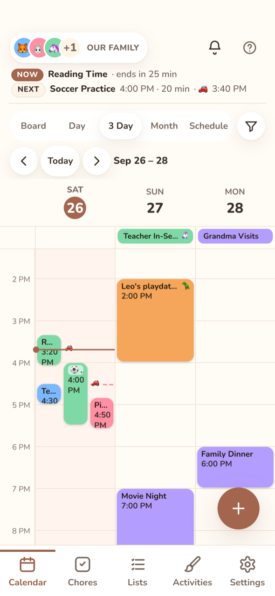
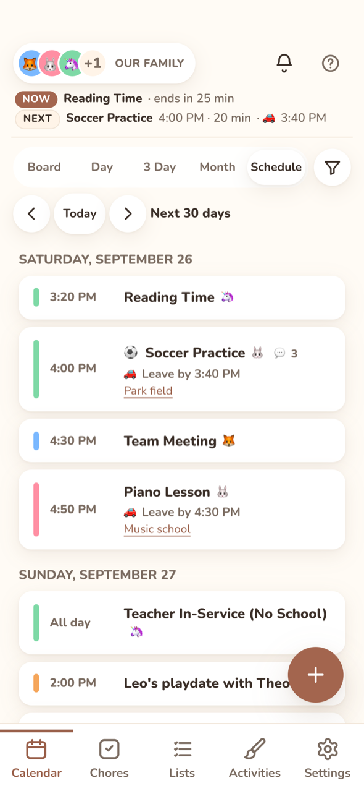
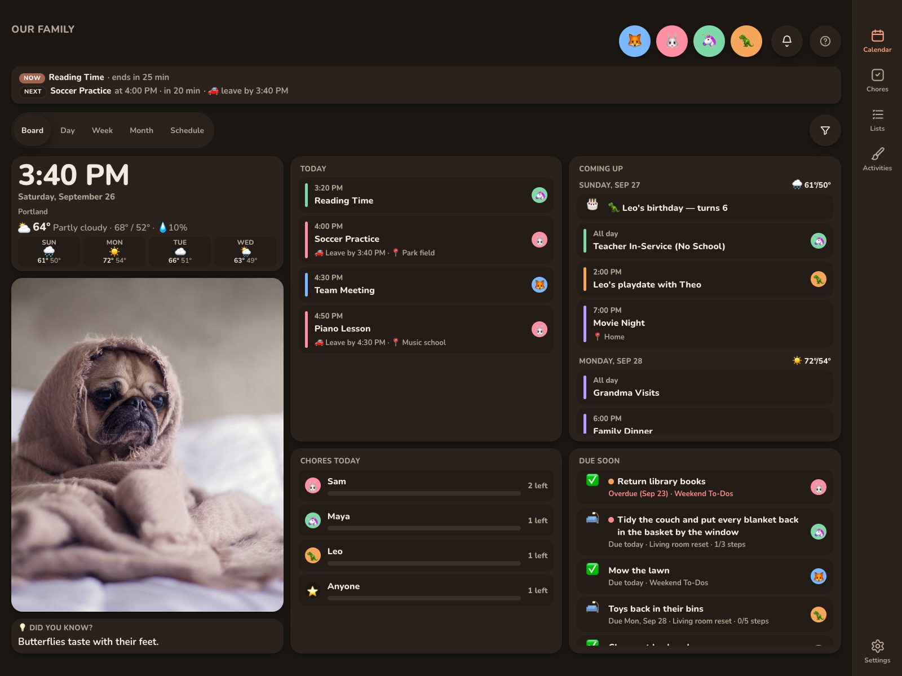
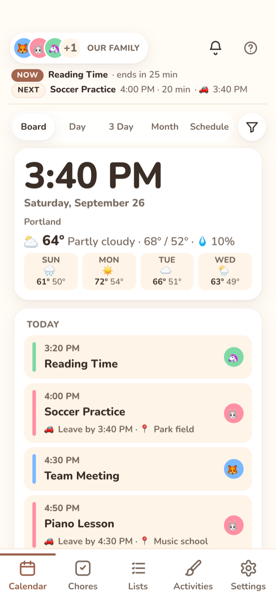
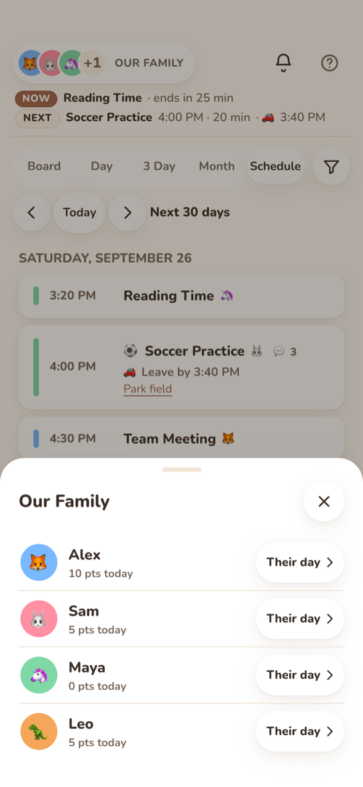

# Calendar

The Calendar tab is the main screen. It merges every enabled calendar into one view. Each event is colored by its [category](categories.md), or by its family member if it has no category.

## Views

Use the segmented control at the top to switch views.

| View | Shows | Paging (◀ ▶ or swipe) |
|---|---|---|
| **Board** | A family bulletin board for today and the week ahead. See [Board view](#board-view). | None: always today onward |
| **Day** | A time grid for one day, one column per family member. | ±1 day |
| **Week** (iPad / desktop) | 7 day columns with an all-day row and a time grid. The week starts on Sunday or Monday, per [General](../settings/general.md). | ±1 week |
| **3 Day** (phones) | The same grid, 3 days from the anchor date. | ±3 days |
| **Month** | A month grid with event chips. When a day is full, it shows "+N more". | ±1 month |
| **Schedule** | An agenda of the next 30 days, grouped by day. Location lines link to maps. | ±30 days |

Every device opens on **Board**; the view switcher runs Board, Day, Week (3 Day on phones), Month, Schedule. You can switch views any time, and a display can be locked to any view (Settings → General → This display → Lock view).

  
  

## Board view

The board carries its own large clock and date, so while it's showing, the wall's header hides its clock and keeps only the family name, avatars and buttons.

**Board** turns the calendar into a bulletin board to read from across the room. It always shows today onward, so it has no ◀ ▶ or swipe paging. Its cards:

* **Clock**: a big clock and the date, with the weather now, today's high and low, and the next 3 days. The weather needs a weather location in [General settings](../settings/general.md).
* **Today**: everyone's events for today, with times or "All day", a bar in each member's color and their avatars. Birthdays 🎂 come first. Events that have finished fade.
* **Coming up**: the next 6 days, grouped by day, with each day's weather and birthdays.
* **Due soon**: open list items due in the next week, overdue ones first in red, plus urgent and important items with no date. Each shows its list's emoji and the owner's avatar.
* **Chores today**: a bar per member showing how many of today's chores are left.
* **Picture**: a new picture every minute, from the same sources as this display's [screensaver](quiet-hours.md#screensaver): drawings, [family photos](photos.md) (with their captions), art (with the painting's title and artist) or nature photos. With no screensaver pictures chosen, it shows your family photos, or nature photos until you've added some.
* **Quote or fact**: a short quote, or an interesting fact marked **💡 Did you know?**. It changes every 30 minutes, alternating between the two. Every display shows the same one at the same time, and no internet is needed.

Tap an event to open it, an item to open its list, or a chore bar to go to Chores. The member and category filters apply to the board's events too. The board refreshes every 10 minutes and whenever something changes. With low-stimulation mode or reduced motion on, the picture and quote change without fading.

On a wall display the cards fill the screen in three columns, and long cards scroll on their own. On phones they stack in one column, with a smaller picture.

To keep a display on the board, set **Lock view** to **Board** in [This display](../settings/this-display.md).

## The header

On a wall display or tablet, the header shows the family name, the time and date, everyone's avatars, the [notification bell](notifications.md#notification-feed) and **Help**.

On a phone, the header is one row:

* The **family button** on the left: a pile of faces and the family name. Tap it to open the family sheet. See [On a phone](#on-a-phone).
* The **bell** and **Help** on the right.

There's no clock on a phone, since the phone already shows the time.

**Help** (the **?** button) is in the same spot on every screen. It opens a short sheet with links to these docs, accessibility notes and where to report a problem, plus the Kinwall version.

The browser tab or window title shows the screen and your family name, for example "Chores · Our Family".

### Now / Next

A strip above the calendar shows what's on now and what's next today, with a countdown and any 🚗 leave-by time. It shows on every view.

* On a wall display it hides when nothing is left today.
* On a phone it's always two lines, so the screen never jumps. When the day is done it reads "Nothing more today".

You can turn it off per device under [Time cues](../settings/this-display.md#time-cues).

## Navigating

* **◀ / ▶** or **swipe** left and right to page. The new period slides in from the side you swiped toward.
* **Today** jumps back to the current date.
* Tap a **day header** (Week) or a **day cell** (Month) to open that day in Day view.
* Tap an **empty slot** in the time grid to add an event at that time, or tap the **+** button.
* Tap an **event** to open its detail sheet. See [Events](events.md).
* Keyboard: arrow keys move between day headers, and Enter opens the day.
* After 2 minutes idle, the app goes back to the Board (or the locked view) on today and closes any open sheet.

## Filters

### By family member

Tap a member's avatar in the header to open [their snapshot](snapshot.md). Its **Show only … on the calendar** switch shows only their events; the other avatars dim. Turn it off to clear the filter.

While the filter is on, the Day view shows only that person's column, so an event they share with others doesn't repeat in other columns. The filter also applies to the Board and the Chores tab.

#### On a phone

Tap the family button at the top left. The family sheet lists everyone, with how many points they've earned today.

* **Tap a person** to show only them. The row says "Calendar shows only them", and their face moves to the front of the pile on the family button.
* **Tap them again** to show the whole family.
* **Their day** opens [their snapshot](snapshot.md), where you can also tick off their chores.

On phones, the view switcher spans the full width, just under the header.

### By category

When any categories exist, a **filter** button appears in the toolbar. It opens **Show categories**:

* Pick one or more categories. **No category** matches events without one.
* With nothing picked, every event shows. **Show all** clears the selection.
* A badge on the button shows how many categories are picked.
* The filter is saved **per device**. A wall display can hide work events for good while phones still see everything.
* Categories deleted since you picked them are ignored, so a stale filter can't hide everything.

The member and category filters combine, and every view honors both.

## How events are colored

* **Category set**: the category color, with the category emoji before the title. Member avatars still show.
* **One member**: that member's color.
* **Two or more members**: diagonal stripes in each member's color, with their avatars.
* **No member**: the calendar's color.

Who an event is for never depends on telling colors apart: the avatars always show too.

## Opening from a notification

Tapping a reminder notification opens `#/calendar?event=<id>&at=<start>`. The calendar jumps to that day and opens the event.
