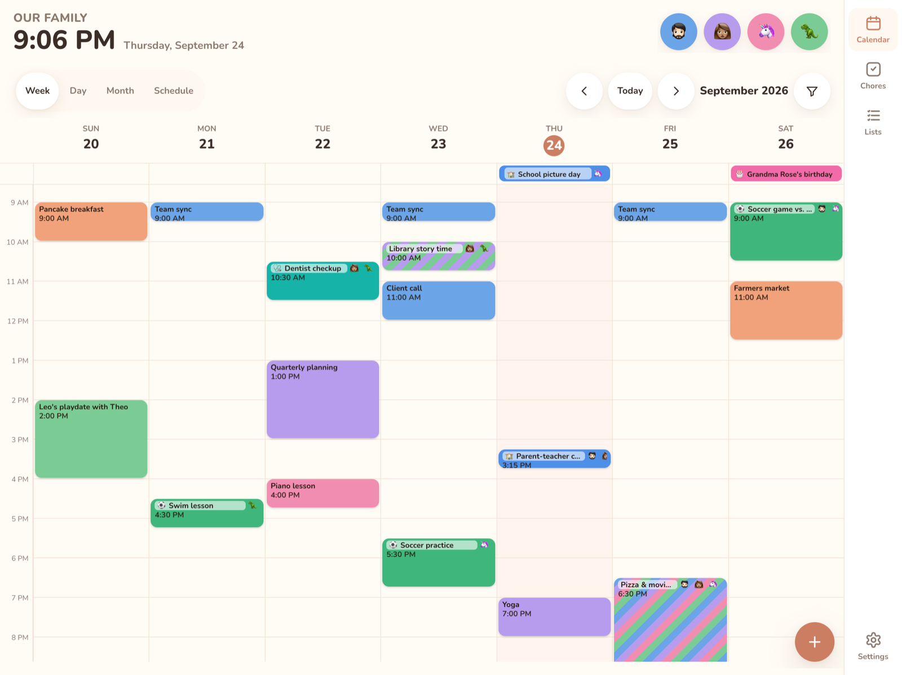

# Calendar

The Calendar tab is the main screen. It merges every enabled calendar into one view. Each event is coloured by its [category](categories.md), or by its family member if it has no category.

## Views

Use the segmented control at the top to switch views.

| View | Shows | Paging (◀ ▶ or swipe) |
|---|---|---|
| **Week** (iPad / desktop) | 7 day columns with an all-day row and a time grid. The week starts on Sunday or Monday, per [General](../settings/general.md). | ±1 week |
| **3 Day** (phones) | The same grid, 3 days from the anchor date. | ±3 days |
| **Day** | A time grid for one day, one column per family member. | ±1 day |
| **Month** | A month grid with event chips. When a day is full, it shows "+N more". | ±1 month |
| **Schedule** | An agenda of the next 30 days, grouped by day. Location lines link to maps. | ±30 days |

Phones open on **Schedule**. The wall display opens on **Week**. You can switch views any time.

  
  

## Navigating

* **◀ / ▶** or **swipe** left and right to page. The new period slides in from the side you swiped toward.
* **Today** jumps back to the current date.
* Tap a **day header** (Week) or a **day cell** (Month) to open that day in Day view.
* Tap an **empty slot** in the time grid to add an event at that time, or tap the **+** button.
* Tap an **event** to open its detail sheet. See [Events](events.md).
* Keyboard: arrow keys move between day headers, and Enter opens the day.
* After 2 minutes idle, the app returns to today and closes any open sheet.

## Filters

### By family member

Tap a member's avatar in the header to open [their snapshot](snapshot.md). Its **Show only … on the calendar** switch shows only their events; the other avatars dim. Turn it off to clear the filter. This filter also applies to the Chores tab.

### By category

When any categories exist, a **filter** button appears in the toolbar. It opens **Show categories**:

* Pick one or more categories. **No category** matches events without one.
* With nothing picked, every event shows. **Show all** clears the selection.
* A badge on the button shows how many categories are picked.
* The filter is saved **per device**. A wall display can hide work events for good while phones still see everything.
* Categories deleted since you picked them are ignored, so a stale filter can't hide everything.

The member and category filters combine, and every view honours both.

## How events are coloured

* **Category set**: the category colour, with the category emoji before the title. Member avatars still show.
* **One member**: that member's colour.
* **Two or more members**: diagonal stripes in each member's colour, with their avatars.
* **No member**: the calendar's colour.

Who an event is for never depends on telling colours apart: the avatars always show too.

## Opening from a notification

Tapping a reminder notification opens `#/calendar?event=<id>&at=<start>`. The calendar jumps to that day and opens the event.
