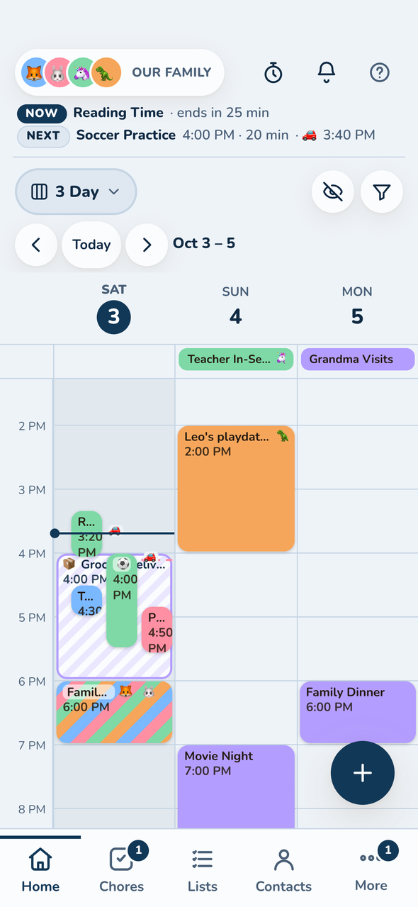
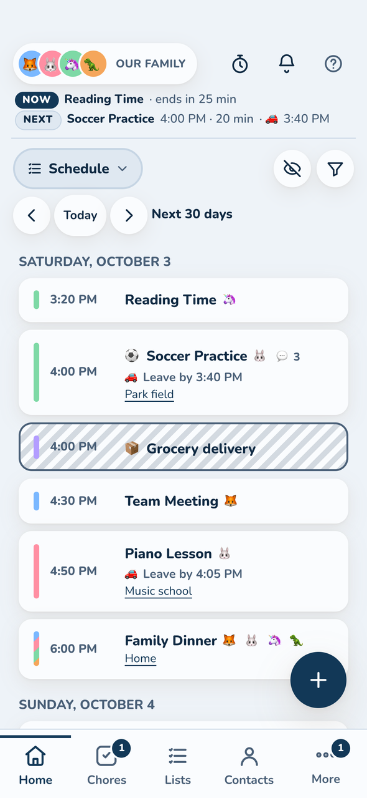
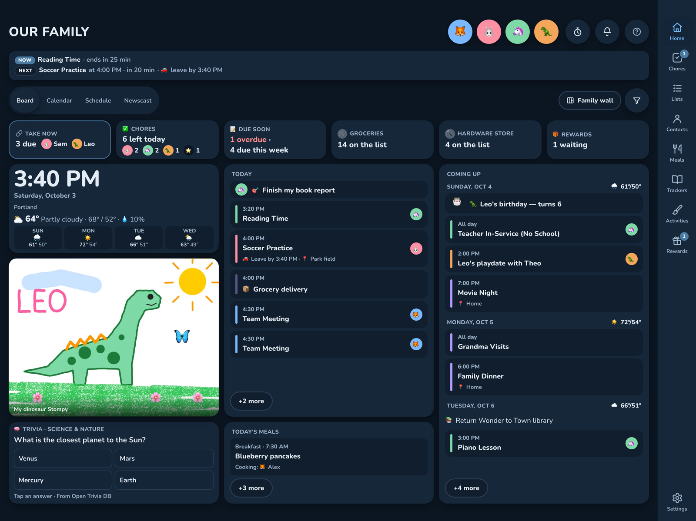
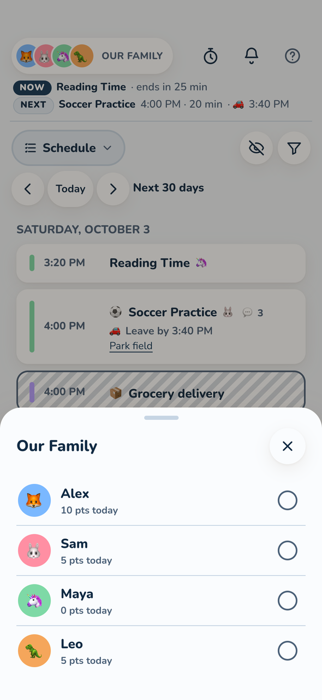

# Calendar

The Calendar tab is the main screen. It merges every enabled calendar into one view. Each event is colored by its [category](categories.md), or by its family member if it has no category.

## Views

Use the tabs at the top to switch views. On a phone the tabs don't fit, so one button shows the current view (like **Board ⌄**): tap it, and a sheet lists the views with a line on what each shows and a ✓ on the current one. Tap a view to switch to it.

| View | Shows | Paging (◀ ▶ or swipe) |
|---|---|---|
| **Board** | A family bulletin board for today and the week ahead. See [Board view](#board-view). | None: always today onward |
| **Day** | A time grid for one day, one column per family member. [Free](events.md#free-or-busy) events sit behind the busy ones, striped and marked "Free". | ±1 day |
| **Week** (iPad / desktop) | 7 day columns with an all-day row and a time grid. The week starts on Sunday or Monday, per [General](../settings/general.md). | ±1 week |
| **3 Day** (phones) | The same grid, 3 days from the anchor date. | ±3 days |
| **Month** | A month grid with event chips. When a day is full, it shows "+N more". | ±1 month |
| **Schedule** | An agenda of the next 30 days, grouped by day. Location lines link to maps. | ±30 days |

Every device opens on **Board**; the view switcher runs Board, Day, Week (3 Day on phones), Month, Schedule. You can switch views any time, and a display can be locked to any view (Settings → General → This display → Lock view).

  
  

## Board view

The board carries its own large clock and date, so while it's showing, the wall's header hides its clock and keeps only the family name, avatars and buttons.

**Board** turns the calendar into a bulletin board to read from across the room. It always shows today onward, so it has no ◀ ▶ or swipe paging.

Across the top, count tiles sum things up; tap one to open its screen (on a phone they come after the clock):

* **💊 Take now**: medicine doses due now, with who; tap it to mark them in a sheet. Only while a dose is due, with [medication reminders](medications.md) on. It shows with **Full lists** too, as the only tile when the others are cards.
* **Chores**: how many of today's chores are left, with each person's avatar and count (a ✓ once they're done), or **All done ✓**.
* **Due soon**: how many to-dos are overdue (in red) and how many are due this week.
* **Groceries**: how many items are still on your [Groceries lists](lists.md#list-types). Hidden if you have none.
* **Shopping**: the same for your Shopping lists (the hardware store and the like). Only while one of them has something on it.

With one list of a type, its tile shows the list's emoji and name and opens it; with several, it opens the Lists page.
* **Rewards**: reward requests waiting for a parent's OK. Hidden when there are none.

Below them are the cards:

* **Clock**: a big clock and the date, with the weather now, today's high and low, and the next 3 days. The weather needs a weather location in [General settings](../settings/general.md).
* **Today**: everyone's events for today, with times or "All day", a bar in each member's color and their avatars. Birthdays 🎂 come first. Events that have finished fade. Above them, 🎯 today's goals from [Temp check](snapshot.md#temp-check), for people who chose to show theirs (on a display pinned to one person, only theirs).
* **Coming up**: the next 6 days, grouped by day, with each day's weather and birthdays.
* **Due soon** (full lists only): open list items due in the next week, overdue ones first in red, plus urgent and important items with no date. Each shows its list's emoji and the owner's avatar.
* **Chores today** (full lists only): a bar per member showing how many of today's chores are left.
* **Today's meals**: today's [meals](meals.md) by slot, with times and who's cooking. The next one is marked. Tap one to open it right on the Board: a recipe meal shows its recipe (with **Start cooking**), and **Edit meal** (parents) or **Meal details** (the cook's notes and status) is a tap away; dining out and other meals open the meal's sheet. With no meals planned, tapping the card goes to Meals to plan one.
* **Picture**: a new picture every minute, from the same sources as this display's [screensaver](night.md#screensaver): drawings, [family photos](photos.md) (with their captions), art (with the painting's title and artist) or nature photos. With no screensaver pictures chosen, it shows your family photos, or nature photos until you've added some.
* **Quote or fact**: a short quote, a fact marked **💡 Did you know?**, a neurodivergent-friendly tip marked **🌱 Try this**, and, if the family turned them on, something from Wikipedia's **On this day** or a **trivia question** with multiple choice (tap a choice to guess, and **Try again** to reset it). It changes every 30 minutes, taking turns through the sources that are on. Every display on the family's choice shows the same one at the same time. Choose the sources and categories in [Settings → Quotes & facts](../settings/general.md#quotes--facts). A screen can pick its own instead, and show up to 3 cards, each with its own sources and a title saying what it shows (like **Trivia**, **Tips** or **On this day**), under [Settings → This display → Board quotes & facts](../settings/this-display.md#this-display). On the wall a second card sits under Coming up and a third shares the picture's column, and each shows what fits with **+N more** for the rest (a trivia card always keeps its answers on the card and scrolls if it has to, so you answer right there); two columns put them side by side; a phone, or a tablet on its side, shows the first card.

Tap an event to open it, an item to open its list, or a chore bar to go to Chores. The member and category filters apply to the board's events too, and the member filter to its chores, to-dos and reward requests: a kid's device, or a display pinned to one person, counts only their chores (plus **Anyone**'s, unless the display hides shared ones), like the Chores tab, their to-dos (assigned to them or on their lists, plus unassigned ones on family lists, which the same setting hides) and their own reward requests. The board refreshes every 10 minutes and whenever something changes. With low-stimulation mode or reduced motion on, the picture and quote change without fading, and in low-stimulation mode the quote cards change once an hour instead of every half hour.

On a wall display or tablet the cards fill the screen in three columns without scrolling. A card shows what fits; when there's more, a **+3 more** button at the bottom opens the whole card in a sheet, right on the Board. **Board chores & to-dos** in [This display](../settings/this-display.md) picks **Counts** (just the tiles), **Full lists** (the Chores today and Due soon cards instead of their tiles) or **Auto** (the default: full lists only on a big screen, at least 1600 × 900 pixels of board, and counts otherwise). On phones they stack in one column, with a smaller picture.

### Board layouts

Each screen can arrange its own Board. Under [Settings → This display → Board layout](../settings/this-display.md#this-display), pick a built-in layout (**Kids** with big text, **Kitchen** with meals up front, **Parents** with more on the screen, **Simple** with just the clock, a picture and today), one of the family's [presets](../settings/general.md#board-presets), or **Own layout** to make one just for this screen.

To switch quickly, tap the **layout** button at the end of the Board's toolbar (on a phone, next to the view button): a sheet lists the same layouts (and **Own layout**, once this screen has one), and **Manage layouts** goes to Settings (to **Board presets** on a parent device, to **Board layout** under This display otherwise). The button is hidden when the screen's view is locked under **Lock view**, so a locked wall stays as set.

The layout editor shows the Board as columns of cards (1 to 4 columns, up to 6 cards in each):

* **Drag** a card by its grip to another place or column, or use its arrows: **↑ ↓** within the column, **← →** to the next column.
* **Height**: **Short**, **Medium** or **Tall**, its share of the column.
* **Text size**: **Big text** to read from across the room, **Normal**, or **Small text** to fit more rows.
* **✕** takes a card off; **Add a card** puts it back. **Count tiles across the top** turns the tiles row on or off; in a layout, the Chores and Due soon tiles show only when their full cards aren't on the Board.
* **Start from** replaces the layout with the family wall layout, a built-in one or a family preset, to change from there.

A card for something the family turned off (like Meals) stays hidden, and so does a quote card with nothing to show. Phones and narrow screens show the layout's cards in one or two columns, in order, column by column.

To keep a display on the board, set **Lock view** to **Board** in [This display](../settings/this-display.md).

## The header

On a wall display or tablet, the header shows the family name, the time and date, everyone's avatars, the [notification bell](notifications.md#notification-feed) and **Help**.

On a phone, the header is one row:

* The **family button** on the left: a pile of faces and the family name. Tap it to open the family sheet. See [On a phone](#on-a-phone).
* The **bell** and **Help** on the right.

There's no clock on a phone, since the phone already shows the time.

**Help** (the **?** button) is in the same spot on every screen. It opens a short sheet with links to these docs, accessibility notes, **Report a problem** and **Suggest a feature** (short GitHub forms; a problem report arrives with the Kinwall version filled in), plus the Kinwall version.

The browser tab or window title shows the screen and your family name, for example "Chores · Our Family".

### Now / Next

A strip above the calendar shows what's on now and what's next today, with a countdown and any 🚗 leave-by time. It shows on every view. Events shown as [free](events.md#free-or-busy), like a delivery window, are left out, so a 12-hour window never sits there as "Now" all day.

* On a wall display it hides when nothing is left today.
* On a phone it's always two lines, so the screen never jumps. When the day is done it reads "Nothing more today".

You can turn it off per device under [Time cues](../settings/this-display.md#time-cues).

## Navigating

* **◀ / ▶** or **swipe** left and right to page. The new period slides in from the side you swiped toward.
* **Today** jumps back to the current date.
* Tap a **day header** (Week) or a **day cell** (Month) to open that day in Day view.
* Tap an **empty slot** in the time grid to add an event at that time, or tap the **+** button.
* Tap an **event** to open its detail sheet. See [Events](events.md).
* Keyboard: arrow keys move between day headers, and Enter opens the day.
* After 2 minutes idle, a wall screen or kid's device goes back to the Board (or the locked view) on today and closes any open sheet, except while an activity is open. Parents' phones and computers don't, unless you turn on **Back to the calendar when idle** on that device ([Settings → General → This display](../settings/this-display.md#this-display)). It can be turned off on a wall screen the same way.

## Filters

### By family member

Tap a member's avatar in the header to open [their snapshot](snapshot.md). Its **Show only … on the calendar** switch shows only their events; the other avatars dim. Turn it off to clear the filter.

While the filter is on, the Day view shows only that person's column, so an event they share with others doesn't repeat in other columns. The filter also applies to the Board and the Chores tab.

#### On a phone

Tap the family button at the top left. The family sheet lists everyone, with how many points they've earned today.

* **Tap a person** to open [their day](snapshot.md), where you can also tick off their chores.
* **The round button** on the right shows only them on the calendar: it fills in, the row says "Calendar shows only them", and their face moves to the front of the pile on the family button. Tap it again to show the whole family.

On phones, the view button sits just under the header, in one row with the Board's layout button (on the Board), **Show hidden** and the filter. Day, 3 Day, Month and Schedule add a second row with ◀ **Today** ▶ and the dates shown.

### By category

When any categories exist, a **filter** button appears in the toolbar. It opens **Show categories**:

* Pick one or more categories. **No category** matches events without one.
* With nothing picked, every event shows. **Show all** clears the selection.
* A badge on the button shows how many categories are picked.
* The filter is saved **per device**. A wall display can hide work events for good while phones still see everything.
* Categories deleted since you picked them are ignored, so a stale filter can't hide everything.

The member and category filters combine, and every view honors both. To hide events for the whole family instead, see [Calendar filters](#calendar-filters) and [Hiding events](#hiding-events).

## Calendar filters

A calendar can show the family only some of its events. The school's calendar, for example, can keep just the days off and half days and leave out every book fair and spirit day. A filter is set per calendar for the whole household, from a parent's device: open **Settings → Calendars**, tap the calendar, then **Filter**. Wall screens and kids' devices can't change it. (To hide a category on one device only, use the [category filter](#by-category) above.)

* **Show**: **All events** (no filter), **Only events that match**, or **All except events that match**.
* **Words in the title**: words or phrases, separated by commas. They match whole words in any case, like [category keywords](categories.md): "break" matches "Winter Break – No School" but not "Breakfast with the Principal". An event matches with any one of them.
* **All-day or timed**: **Either**, **All-day only** or **Timed only**.
* **Categories**: optional. When you pick some, an event matches only with one of them.

An event matches when it fits every choice you made: one of the words, and all-day (if you picked that), and one of the categories (if you picked any). A filter with no words, categories or all-day choice does nothing.

**Start from a preset** fills everything in, and you can change it after:

| Preset | Shows | Words |
|---|---|---|
| **School: days off & half days** | Only matching all-day events | no school, closed, day off, vacation, break, holiday, recess, half day, early release, early dismissal, professional development, PD day, teacher workshop, in-service, snow day, conferences, and US holidays like Labor Day and Thanksgiving |
| **Holidays only** | Only matching events | holiday, and holidays like Thanksgiving, Christmas, Hanukkah, Diwali and Lunar New Year |
| **Hide birthdays** | All except matching | birthday, bday, b-day |

While you edit, the sheet previews the next 3 months: "Showing 14 of 212 events in the next 3 months", with the shown and hidden events listed, soonest first. **Save** applies it right away.

A filtered-out event is gone everywhere the family sees events: every calendar view, the Board, Now / Next, [reminders, transition warnings and leave-by pushes](notifications.md), Live Activities, the daily summary, [snapshots](snapshot.md) and the [assistant](../integrations/mcp.md). Nothing is deleted: Kinwall still syncs every event and decides what to show when it reads them, so changing a filter needs no resync and hidden events come back as soon as you change it.

## Hiding events

A parent can hide one event from the whole family, even one that comes from a read-only calendar like a school feed. Open the event, then **Hide…** at the bottom of its sheet (parents' devices only; wall screens and kids' devices don't have it):

* **Hide this event**, or for a recurring event **Just this one** or **Every one in the series**. Occurrences a synced series adds later are hidden too.
* **Hide events like this**: adds the event's title to the calendar's [filter](#calendar-filters) as an exception ("All except events that match"), after asking. Every event with those words in its title stays hidden, including new ones. When the calendar shows **Only events that match**, a word can't hide more, so the sheet says to change the filter in Settings instead.

Hidden events are gone everywhere a filtered-out event is (see above), and they stay hidden after every sync: Kinwall remembers them by the provider's own ids, like the members and categories you set on synced events.

To bring one back:

* **Settings → Calendars**, tap the calendar, then **Hidden events**: each one hidden (or each series, "Every one in the series") with **Show again**.
* Or on the calendar, tap the **eye** button at the end of the toolbar, next to the filter (parents' devices, every view but the Board). Hidden and filtered-out events then show faded, with a dashed border and an eye-slash and "Hidden" before the title, so they never rely on color. Open one for **Show again**, or, for one the filter leaves out, a link to change the filter. Tap the eye again to hide them.

## How events are colored

* **Category set**: the category color, with the category emoji before the title. Member avatars still show.
* **One member**: that member's color.
* **Two or more members**: diagonal stripes in each member's color, with their avatars.
* **No member**: the calendar's color.

Who an event is for never depends on telling colors apart: the avatars always show too.

## Opening from a notification

Tapping a reminder notification opens `#/calendar?event=<id>&at=<start>`. The calendar jumps to that day and opens the event.

`#/calendar?checkin=<member id>` opens that person's day at their check-in. See [Daily check-in](snapshot.md#daily-check-in).
