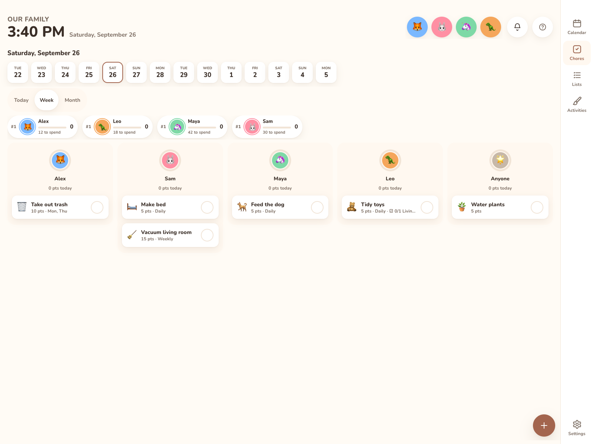

# Chores



The Chores tab shows one column per family member plus **🌟 Anyone**. Each column has a progress ring, a "*N* pts today" total and that day's chore cards. On phones, members with nothing due are listed on one line ("Nothing due: Leo") instead of showing as empty cards. When the family is filtered to one person (the family sheet on a phone, or an avatar on the wall), the tab shows that person and **Anyone**. A display pinned to one person hides **Anyone** only if **Also show things for everyone** is off.

Don't use chores? An admin can turn off **Chores & points** in **Settings → General → Features**. It's hidden on every screen (the sticker book too); nothing is deleted. See [Features](../settings/general.md#features).

## Completing chores

* **Tap** a card to mark it done (with a check and a small confetti burst). Tap again to undo.
* A **date strip** lets you look at 4 days back and 9 days ahead. You can complete chores for any day shown.
* Completing a chore credits the chore's assignee. Ticking off an **Anyone** chore on the Chores tab asks **Who did it?**: pick the person who earns the points, or **Nobody in particular**. It doesn't ask when the family is filtered to one person or the display is pinned to one; the chore counts for that person. Unticking never asks. A done **Anyone** chore says who got the points, such as "Done by Sam", or "Done by nobody in particular".
* To edit a chore, **press and hold** (half a second), right-click, or tab to it and use its **Edit** button.

## Ticking chores off from someone's day

A person's day (their snapshot) lists their chores for today, plus **Anyone** chores. Tap a chore to mark it done or not done, the same as on the Chores tab. An **Anyone** chore done from someone's day counts for that person. A chore with a checklist that still has open items opens the checklist first.

On a phone, open someone's day from the family button at the top left, then **Their day**.

## Creating and editing

Tap **+** (Add chore). The sheet has:

| Field | Notes |
|---|---|
| **Title**, **Emoji** | |
| **Points** | A whole number. |
| **Assign to** | **🌟 Anyone** or one member. |
| **Repeat** | **Once**, **Daily** or **Weekly**. |
| **On** (Weekly) | Pick weekdays. With none picked, it repeats on the weekday it was created. A new chore pre-selects today. |
| **Ends (optional)** (Daily/Weekly) | The last date it's due. It's stored as `UNTIL` in the rule. |
| **Due date** (Once) | The day a one-off chore is due. |
| **Checklist (optional)** | A list that has to be fully ticked before the chore can be completed. See [Checklists](#checklists). |

Chores created through the API or MCP can use any RRULE (for example `FREQ=MONTHLY` or `INTERVAL=2`). The sheet shows those as "Custom schedule (…)" and leaves them alone unless you pick another option. A recurring chore without a due date starts on the day it was created, in the household timezone.

**Delete** removes the chore along with its history and points.

## Checklists

A chore can have a **checklist**: one of your [lists](lists.md). Any kind of list works, but a **reusable** list fits best, such as "Bedtime routine: pick out clothes, shower, pajamas, brush teeth". Pick it under **Checklist (optional)** when you add or edit the chore.

* The chore card shows the progress, for example `☑ 2/4 Bedtime`.
* Tapping the chore while items are still open opens the checklist in a sheet instead of completing it. Tick items off there, or add one with **Add a step…**.
* The button at the bottom says how many are left ("2 left on Bedtime"). Once every item is ticked it becomes **Complete *chore***.
* Completing the chore resets a reusable checklist, ready for next time. Other kinds of list stay as they are.
* **Edit the *list* list** at the bottom of the sheet opens the full list, where you can reorder items, add notes and add sub-steps.

### One list for several people

A chore's checklist shows the list's items **assigned to the chore's person, plus the unassigned ones**. A chore for **Anyone** shows the whole list.

So one "Bedtime" list can serve both Maya's and Leo's bedtime chores:

* Give each child their own "Shower" and "Brush teeth" items (set **Assign to** in the item sheet).
* Leave shared steps, like "Turn off the hall light", unassigned.

Ticks are saved on the list itself. A shared item ticked by one child is ticked for the other too, while each child's own steps stay separate. Completing the chore resets only that person's items and the shared ones. Steps added from the chore's sheet are assigned to the chore's person.

**API and MCP:** `listId` on `POST/PATCH /api/chores`, `checklist` progress on `GET /api/chores/day`, and `POST /api/chores/{id}/complete` answers **409** with `remaining` while items are open. In MCP, use the `list` argument on `create_chore` and `update_chore`.

## Points, late completion credit

Points are fixed at the moment you tick a chore off. Changing a chore's points later doesn't rewrite history.

* Completed **on its day, or early**: full points.
* Completed **for a past day**: `lateCompletionCredit` percent of the points, rounded. The default is **50%** (0–100).
* Re-ticking an existing completion (for example, to change who did it) keeps the points it already earned.

## Streaks and grace days

A member's 🔥 streak counts consecutive days on which **every chore assigned to them and due that day** was completed.

* Days with nothing due are skipped. They don't break the streak.
* Today only counts once its chores are done.
* `streakGraceDays` (0–3, default **1**): a streak survives that many missed days in any rolling 7 days. Set it to 0 for the strict rule, where any miss ends the streak.
* Streaks look back at most 60 days. 🔥*N* shows from 2 days up.

## Leaderboard

Above the columns, a leaderboard ranks members by points for **Today**, **Week** or **Month**. The period is remembered per device, and the week follows the household week start.

* Ranking is by points, then completions, then name. Members with equal points and completions share a rank.
* The leader gets 👑 (bouncing when the lead changes). Members with no activity still appear.
* `leaderboardEnabled` (default on): turn it off for families that prefer no competition. Apps then hide the leaderboard and rank badges. The API still answers.

## Points to spend

Points are also a currency. A member's **balance** is every point they've ever earned from chores, minus what they've spent in the [sticker shop](activities.md#sticker-book).

* The leaderboard and the member's today/week points always count what was **earned**. Spending never lowers a rank.
* With the sticker shop on, each leaderboard pill also shows the balance, such as "22 to spend".
* Spending is recorded in a points ledger. `GET /api/members/{id}/points` returns `{ balance, earnedTotal, spentTotal, entries }`, with the last 50 ledger entries. The member list (`GET /api/members`) includes `balance` too.
* Unticking a completed chore takes its points back out of the balance. So does deleting a chore, since its completion history goes with it. A balance can end up below zero that way. New purchases then wait until it's back up.
* **Settings → Family → Chores** has **Sticker shop** (on/off) and **Sticker prices** (Free, 50%, 100% or 150%).

## Setting these options

`lateCompletionCredit`, `streakGraceDays`, `leaderboardEnabled`, `stickersEnabled` and `stickerPriceScale` are household settings. Change them with `PATCH /api/settings`:

```bash
curl -X PATCH https://kinwall.example/api/settings -H "Authorization: Bearer $KEY" \
  -H "Content-Type: application/json" -d '{"lateCompletionCredit":100,"streakGraceDays":0,"leaderboardEnabled":false}'
```

They're included in [export and import](../your-data/export-import.md).

## Notifications

A per-device **Chore reminder** at a set time lists chores still open today for the members that device follows. See [Notifications](notifications.md).

## API and MCP

* `GET /api/chores/day?date=YYYY-MM-DD`, `POST /api/chores/{id}/complete {date, memberId?}`, `DELETE /api/chores/{id}/complete?date=`
* `GET /api/leaderboard?period=today|week|month`
* `GET /api/members/{id}/points`
* MCP: `list_chores`, `create_chore`, `update_chore`, `complete_chore`, `uncomplete_chore`, `get_leaderboard`, `get_points`
