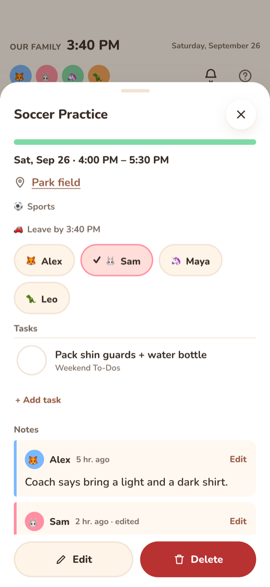

# Events

## The detail sheet

Tap an event to open its sheet. It shows:

* **When**: the date and time range, or "All day". Multi-day all-day events show their date range.
* **Location**: a link. If the location contains a URL (a video-call link), that URL opens. A street address opens Apple Maps on Apple devices and Google Maps elsewhere. Obviously virtual places ("Zoom", "Teams", "online", "TBD") stay plain text.
* **Repeats**, if the event recurs.
* **Category**: "🎂 Birthdays". See [Categories](categories.md).
* **Reminder**: "🔔 30 min before". "· default" is added when it comes from the household default.
* **Family member chips**: tap to tag or untag people. See [Members on events](#members-on-events).
* **Description**, always shown as plain text.
* **Tasks**: list items linked to this event. See [Linked tasks](#linked-tasks).
* **Notes**: the family's notes on this event. See [Notes](#notes).
* **Edit** and **Delete**, only on writable calendars. Delete asks for **Confirm delete**. An event from Google or Outlook is deleted there too.

## Creating and editing

Tap **+**, or tap an empty slot in the time grid (this pre-fills the time). The edit sheet has:

| Field | Notes |
|---|---|
| **Title** | Required. |
| **All day** | All-day events are stored as dates. The end date you pick is inclusive. |
| **Starts / Ends** | Native date and time pickers. Moving the start past the end drags the end along. |
| **Calendar** | Only writable, enabled calendars are listed. If you have no local calendar yet, **Kinwall only (not synced)** creates one called "Kinwall". |
| **Location** | Optional. |
| **Who** | Family member chips. |
| **Reminder** | Local, Google and Outlook calendars only. Options: None, 5, 10, 15 or 30 minutes, 1 hour, 1 day, plus **Household default** (local) or **Google calendar default** (Google). Outlook has no "default" to write back. Reminders that came from the provider and don't match a preset stay as they are. |
| **Repeat** | Does not repeat, Daily, Weekly or Monthly. More complex rules from a provider or the API are kept as long as you don't change this menu. |
| **Category** | **Automatic** (keyword or calendar default, with a hint showing which) or a specific category. On a recurring event, **Apply the category to** offers **All events** or **This event**. |

When you edit, only the fields you changed are sent. An unrelated edit never pins an inherited member list or category onto the event, and never restarts a repeating series.

### Recurring events

* **Local recurring events** are one series. Edit and delete apply to the whole series.
* **Synced recurring events** (Google, Outlook, CalDAV) arrive as separate occurrences. Members and category can be set for **This event** or for **All events in the series**. Travel time is per occurrence.

## Reminders

A reminder fires at *start − minutes*. For all-day events it counts back from the start of the day in the household timezone. Reminders are:

* stored on the event for local calendars,
* written through to **Google** (popup reminders) and **Outlook** (a single reminder), so their own apps honor them,
* read-only for CalDAV and ICS events, which use whatever the feed says.

Events without their own reminder use the household **Default reminder** (30 minutes unless changed). See [General](../settings/general.md). An event whose reminder was set to **None** never uses the default. For delivery, see [Notifications](notifications.md).

## Travel time and leave-by

An event can have a **travel time** (0–600 minutes). Kinwall then shows a **leave-by** time (start − travel time). The API exposes it as `leaveAt`. If you also turn on **remind before leave**, reminders count back from the leave-by time instead of the start, and the notification reads "Leave by 5:20 PM for Soccer practice · starts 6:00 PM".

* Travel time is **Kinwall-only**: it's never written to Google or Outlook, and it works on read-only calendars too.
* All-day events have no leave-by time.
* On synced recurring events, it's set per occurrence.
* API fields: `travelMinutes`, `remindBeforeLeave` (write) and `leaveAt` (read), on `POST/PATCH /api/events` and the MCP `create_event` / `update_event` tools.

## Members on events

An event's people come from, in order:

1. a tag on **this event** ("Tagged for this event"),
2. a tag on **the whole series** ("Tagged for the whole series"),
3. the **calendar's** members ("From the calendar").

Tapping chips in the detail sheet saves immediately, even on read-only ICS events, because tags are stored only in Kinwall. On a recurring synced event, Kinwall asks **This event** or **All events in the series** first.

## Linked tasks

The **Tasks** block in the detail sheet lists [list items](lists.md) linked to the event, open ones first.

* Tick a task to mark it done.
* Tap **+ Add task**, type the task, pick a list, and press Enter to add a linked item. Kinwall remembers the list you used last. Escape (or leaving the field empty) folds the form away again.
* The daily summary notification includes "To do for today's events", up to three open tasks per event.

## Notes

Anyone can leave a note on an event: "Bring shin guards", "I can drive", a link to the snack sign-up. Notes sit under **Tasks** in the detail sheet, oldest first, each with the poster's avatar and name in their color and a colored bar down the side, plus when it was posted ("5 min. ago") and "· edited" once changed. Links in a note open in a new tab.

* **+ Add note** opens a text box and **Post as** chips. The chip starts on the person selected in the header, else whoever you posted as last. **Someone** posts without a name. Separate thoughts are separate notes.
* Tap a note (or its **Edit**) to change the text, then **Save**, **Cancel** or **Delete** (which asks first). Escape cancels.
* In **Schedule**, an event with notes shows 💬 and the count.
* A recurring local event keeps one thread for the whole series. A synced event's notes survive every sync, because synced events keep the same Kinwall id; if an event drops out of the feed, its notes wait and come back with it. Deleting an event in Kinwall deletes its notes.
* Notes are Kinwall-only and never go to Google or Outlook. Export includes notes on local events (and list items); notes on synced events are not exported.
* API: `GET /api/notes?target=event:<id>`, `POST /api/notes` `{target, body, memberId?}` (1–2000 characters; no `memberId` = "Someone"), `PATCH /api/notes/{id}` `{body}`, `DELETE /api/notes/{id}`. Events from `GET /api/events` carry `noteCount`. Display keys can read and write notes. MCP: `list_notes`, `add_note`, `update_note`.

## Kinwall-only vs synced fields

| Stays in Kinwall | Goes to the provider (writable calendars) |
|---|---|
| Members, category, travel time / leave-by, linked tasks, notes | Title, time, all-day, location, description, recurrence, reminders (Google/Outlook) |

When an event is read-only, the sheet says: "Only the family members and travel time are saved in Kinwall — the event itself comes from *calendar name*". For how that's decided, see [Writable vs read-only](../calendars/writable-vs-read-only.md).
