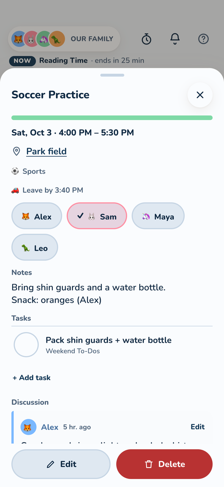

# Events

## The detail sheet

Tap an event to open its sheet. It shows:

* **When**: the date and time range, or "All day". Multi-day all-day events show their date range.
* **Location**: a link. If the location contains a URL (a video-call link), that URL opens. A street address opens Apple Maps on Apple devices and Google Maps elsewhere. Obviously virtual places ("Zoom", "Teams", "online", "TBD") stay plain text.
* **Repeats**, if the event recurs.
* **Category**: "🎂 Birthdays". See [Categories](categories.md).
* **Reminder**: "🔔 30 min before". "· default" is added when it comes from the household default.
* **Family member chips**: tap to tag or untag people. See [Members on events](#members-on-events).
* **Notes**: the event's own notes (its description), as plain text with its line breaks. Links in them open in a new tab. See [Event notes](#event-notes).
* **Tasks**: list items linked to this event. See [Linked tasks](#linked-tasks).
* **Discussion**: the family's back-and-forth on this event, separate from its notes. See [Discussion](#discussion).
* **Hide…**, on parents' devices: hide this event, every one in its series, or every event like it, from the whole family. See [Hiding events](calendar.md#hiding-events). A hidden event (with the calendar's **Show hidden** eye on) says "Hidden" with **Show again** instead.
* **Edit** and **Delete**, only on writable calendars this device may change (see [Who can change events](#who-can-change-events)). Delete asks for **Confirm delete**. An event from Google or Outlook is deleted there too.

## Creating and editing

In the Kinwall app for iPhone, the Shortcuts app also has an **Add an event** action: a title, when it starts, and optionally when it ends (the family's [new event length](../settings/calendars.md#calendars) later otherwise) and the calendar (the family's default for new events otherwise).

Tap **+**, or tap an empty slot in the time grid (this pre-fills the time). After you save, "Event added" (or "Event updated") shows at the bottom with **View**, which opens the event, from the calendar or any other tab. **+** starts on the day you're looking at, at the next half hour today or 9 AM on another day; see [Navigating](calendar.md#navigating). The edit sheet has:

| Field | Notes |
|---|---|
| **Title** | Required. |
| **All day** | All-day events are stored as dates. The end date you pick is inclusive. |
| **Starts / Ends** | Native date and time pickers. Picking a start fills in the end, the family's [new event length](../settings/calendars.md#calendars) later (an hour unless a parent changed it), crossing into the next day when it has to. Once you change the end yourself (or edit an event that already has one), moving the start keeps the length you set. For an all-day event, moving the start past the end drags the end along. |
| **Calendar** | Starts on the family's [default calendar for new events](../settings/calendars.md#calendars). Only writable, enabled calendars this device may change are listed. On a kid's device that's only their own calendars, with the first one picked. If you have no local calendar yet, **Kinwall only (not synced)** creates one called "Kinwall". |
| **Location** | Optional. |
| **Notes** | Optional, several lines: what to bring, a link, a gate code. See [Event notes](#event-notes). |
| **Who** | Family member chips. |
| **Show as** | **Busy** (the default) or **Free (doesn't block time)**. See [Free or busy](#free-or-busy). |
| **Reminder** | Local, Google and Outlook calendars only. Options: None, 5, 10, 15 or 30 minutes, 1 hour, 1 day, plus **Household default** (local) or **Google calendar default** (Google). Outlook has no "default" to write back. Reminders that came from the provider and don't match a preset stay as they are. |
| **Repeat** | Does not repeat, Daily, Weekly or Monthly. More complex rules from a provider or the API are kept as long as you don't change this menu. |
| **Category** | **Automatic** (keyword or calendar default, with a hint showing which) or a specific category. On a recurring event, **Apply the category to** offers **All events** or **This event**. |

When you edit, only the fields you changed are sent. An unrelated edit never pins an inherited member list or category onto the event, and never restarts a repeating series.

### Who can change events

Parents' phones and computers can change events on every calendar. Wall screens and kids' devices depend on the calendar:

* **Wall screens and kids' devices can edit** (in **Settings → Calendars → Edit calendar**) is on for every calendar to start with. When it's off, only a parent's device can add, change or delete that calendar's events.
* A **kid's device** (a wall screen, tablet or phone that belongs to one member, and the widgets and Apple Watch that go with it) can add, change and delete events only on calendars that are for that member: the calendar's **Members** include them. Other events open read-only, with "This device can't change events on *calendar*." Say Leo's tablet: it can add soccer practice to Leo's calendar, but not change the Family calendar or Maya's.
* A kid with no calendar of their own can't add events. In place of the **+** button, their device says "Ask a parent to give you a calendar in Settings → Calendars."
* A **Shared** wall screen can change events on any calendar that has the switch on.

This covers everything that changes an event: its details, its people and travel time, deleting it, and adding a task to it (or moving a task off it). Reading is never limited. Notes are conversation, so anyone can post one on any event. Ticking or editing a task that's already linked is a list edit, so it works as on any list. An event can't be moved to another calendar from Kinwall on any device.

The API answers a refused change with `403`, for example `{"error":"This device can only change events on Leo's calendars."}`. `GET /api/calendars` gives each calendar `displayEdit` (the switch) and `canEditEvents` (whether the key asking may change its events).

### Recurring events

* **Local recurring events** are one series. Edit and delete apply to the whole series.
* **Synced recurring events** (Google, Outlook, CalDAV) arrive as separate occurrences. Members and category can be set for **This event** or for **All events in the series**. Travel time is per occurrence.

## Reminders

A reminder fires at *start − minutes*. For all-day events it counts back from the start of the day in the household timezone. Reminders are:

* stored on the event for local calendars,
* written through to **Google** (popup reminders) and **Outlook** (a single reminder), so their own apps honor them,
* read-only for CalDAV and ICS events, which use whatever the feed says.

Events without their own reminder use the household **Default reminder** (30 minutes unless changed). See [General](../settings/general.md). An event whose reminder was set to **None** never uses the default. For delivery, see [Notifications](notifications.md).

## Travel time and leave-by

An event can have a **travel time** (0–600 minutes). Kinwall then shows a **leave-by** time (start − travel time). The API exposes it as `leaveAt`. If you also turn on **remind before leave**, reminders count back from the leave-by time instead of the start, and the notification reads "Leave by 5:20 PM for Soccer practice · starts 6:00 PM".

* Travel time is **Kinwall-only**: it's never written to Google or Outlook, and it works on read-only calendars too.
* All-day events have no leave-by time.
* On synced recurring events, it's set per occurrence.
* API fields: `travelMinutes`, `remindBeforeLeave` (write) and `leaveAt` (read), on `POST/PATCH /api/events` and the MCP `create_event` / `update_event` tools.
* A meal's event shows **start prep by** instead (🍳, see [Meals → The calendar](meals.md#the-calendar)).

## Members on events

An event's people come from, in order:

1. a tag on **this event** ("Tagged for this event"),
2. a tag on **the whole series** ("Tagged for the whole series"),
3. the **calendar's** members ("From the calendar").

Tapping chips in the detail sheet saves immediately, even on read-only ICS events, because tags are stored only in Kinwall. On a recurring synced event, Kinwall asks **This event** or **All events in the series** first.

## Linked tasks

The **Tasks** block in the detail sheet lists [list items](lists.md) linked to the event, open ones first.

* Tick a task to mark it done.
* Tap **+ Add task**, type the task, pick a list, and press Enter to add a linked item. Kinwall remembers the list you used last. Escape (or leaving the field empty) folds the form away again.
* The daily summary notification includes "To do for today's events", up to three open tasks per event.

## Event notes

**Notes** in the edit sheet is the event's own description: one block of text that belongs to the event, under **Location**. It's the same field Google, Outlook and CalDAV call the description, and it syncs both ways:

| Calendar | Notes come from | Written back |
|---|---|---|
| **Local** | What you type | — |
| **Google** | `description` | Yes |
| **Outlook** | The event body (all of it, as text) | Yes, as text |
| **CalDAV / iCloud** | `DESCRIPTION` | Yes |
| **ICS feeds** | `DESCRIPTION` | Read-only: shown, not editable |

* Kinwall keeps notes as plain text. Formatting from Google or Outlook (bold, lists, links) arrives as text with its line breaks, and a link keeps its address. Nothing in notes is ever shown as HTML.
* Notes are written back only when you change them, so editing an event's time or title leaves Google's or Outlook's formatting as it was. Changing the notes replaces them there with your plain text. Emptying the box clears them.
* A read-only event shows its notes in the detail sheet; they can't be edited in Kinwall.
* API: `description` on `POST/PATCH /api/events` (`""` clears it) and on every event read. MCP: `description` on `create_event` / `update_event`. Export and import keep it.

## Discussion

Anyone can leave a note in an event's discussion: "Bring shin guards", "I can drive", a link to the snack sign-up. The **Discussion** sits under **Tasks** in the detail sheet, oldest first, each with the poster's avatar and name in their color and a colored bar down the side, plus when it was posted ("5 min. ago") and "· edited" once changed. Links in a note open in a new tab.

* **+ Add note** opens a text box and **Post as** chips. The chip starts on the person selected in the header, else whoever you posted as last. **Someone** posts without a name. Separate thoughts are separate notes.
* Tap a note (or its **Edit**) to change the text, then **Save**, **Cancel** or **Delete** (which asks first). Escape cancels.
* A kid's own device posts as the kid (no **Post as**) and edits or deletes only the kid's notes. A wall screen posts as anyone but edits or deletes only notes posted as **Someone**. A parent's phone or computer changes any note.
* In **Schedule**, an event with notes shows 💬 and the count.
* A recurring local event keeps one thread for the whole series. A synced event's notes survive every sync, because synced events keep the same Kinwall id; if an event drops out of the feed, its notes wait and come back with it. Deleting an event in Kinwall deletes its notes.
* An admin can turn notes off in **Settings → General** (tap **Change** under **Features**) (events and list items alike). They're hidden, not deleted. See [Features](../settings/general.md#features).
* The discussion is Kinwall-only and never goes to Google or Outlook. Export includes discussion notes on local events (and list items); notes on synced events are not exported.
* API: `GET /api/notes?target=event:<id>`, `POST /api/notes` `{target, body, memberId?}` (1–2000 characters; no `memberId` = "Someone"), `PATCH /api/notes/{id}` `{body}`, `DELETE /api/notes/{id}`. Events from `GET /api/events` carry `noteCount`. Display keys can read and write notes: a member's own device posts as that member (another `memberId` is `403`; none = them) and changes only their notes; a shared wall changes only notes with no `memberId`; anything else is `403`. MCP: `list_notes`, `add_note`, `update_note`.

## Free or busy

Every event is **busy** or **free**, like "Show as" in Google Calendar and Outlook. Most events are busy. Mark one **free** when it's worth seeing but doesn't take anyone's time: a delivery window ("📦 HelloFresh delivery, 8 AM – 8 PM"), a school's office hours, a "maybe" block. Change it in the edit sheet under **Show as**.

A free event:

* is outlined and striped instead of filled (on the Board, its color bar is faded), so it never relies on color alone; screen readers hear "free" with it;
* sits behind busy events in the Day and Week grids, at full width, and never pushes a busy event into half a column. A busy event that overlaps it steps in a little so the free event's edge still shows;
* is never **Now** or **Next** in the [Now / Next](calendar.md#now--next) strip;
* gets no transition warnings, no leave-by time and no leave-by Live Activity (its travel time is kept, for if it's busy again);
* doesn't count as a busy hour in [Insights](insights.md) or the [energy battery](battery.md);
* still fires its own reminders, and still shows on the Board, in snapshots and in the daily summary.

Where it comes from:

| Calendar | Free when | Written back |
|---|---|---|
| **Local** | You pick **Free** | — |
| **Google** | The event's "Show as" is **Free** (`transparency: transparent`). Google marks new all-day events free on its own. | Yes |
| **Outlook** | "Show as" is **Free** (`showAs: free`). **Tentative**, **Busy**, **Away** and **Working elsewhere** all count as busy. | Yes; an edit that doesn't touch Show as leaves a tentative or away event as it is |
| **CalDAV / iCloud** | `TRANSP:TRANSPARENT` | Yes (`TRANSP`) |
| **ICS feeds** | `TRANSP:TRANSPARENT`; with no `TRANSP`, busy | Read-only |

In the API and the assistant it's `busy` (`true` or `false`) on `POST/PATCH /api/events`, `PUT /api/calendars/{id}/events/sync` and the MCP `create_event` / `update_event` tools.

## Kinwall-only vs synced fields

| Stays in Kinwall | Goes to the provider (writable calendars) |
|---|---|
| Members, category, travel time / leave-by, hidden, linked tasks, discussion | Title, time, all-day, location, notes (description), recurrence, reminders (Google/Outlook), free/busy |

When an event is read-only, the sheet says: "Only the family members and travel time are saved in Kinwall — the event itself comes from *calendar name*". For how that's decided, see [Writable vs read-only](../calendars/writable-vs-read-only.md).
