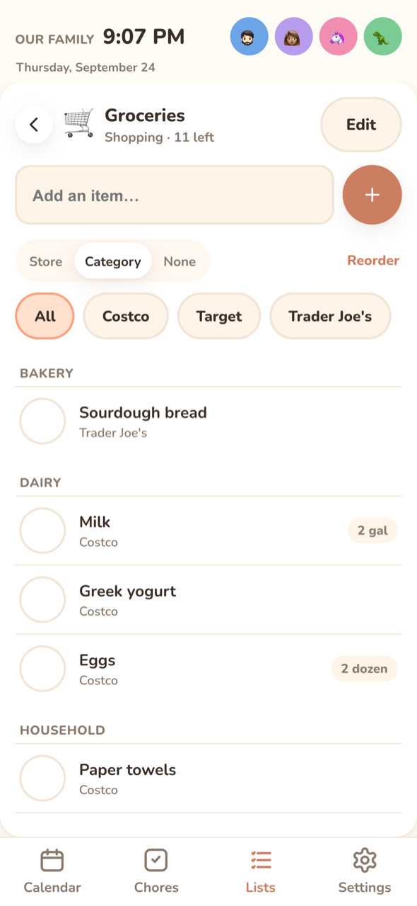
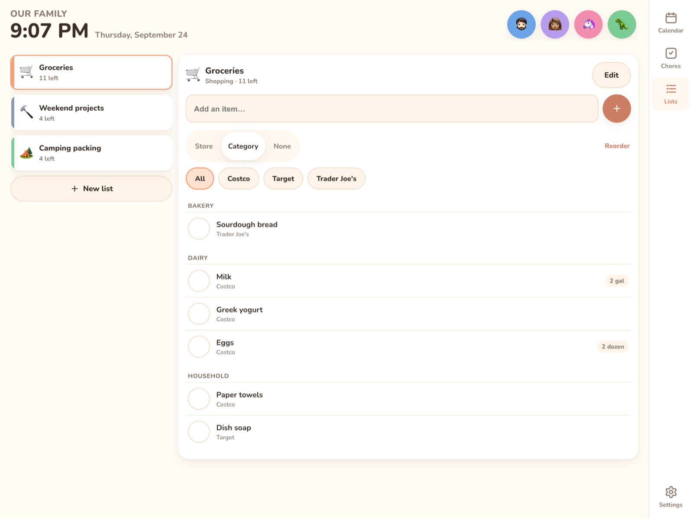

# Lists

  

The Lists tab shows your lists and their open-item counts. On the wall display, the open list sits next to them. On a phone, you tap into one. **New list** or **+** creates a list. Press and hold a list card to edit it.

## Kinds

| Kind | For | Extras |
|---|---|---|
| **Shopping** | groceries, hardware runs | Items have a **Store** and a **Category**. Group by Store, Category or None (default Category). |
| **To-do** | jobs, errands | Items have an assignee (**Assign to**) and a **Due date**. |
| **Reusable** | packing lists, routines | Items have an assignee. **Reset list** unticks everything (steps too) so you can use it again. |

You can change a list's kind later.

## Editing a list

**Edit** opens **Name**, **Kind**, **Emoji**, **Color** and **Owners (nobody = whole family)**. It also has **Archive** (next to delete) and delete, which removes all the list's items too. Archived lists are hidden from the main Lists view and collect in a collapsed **Archived (*N*)** section at the bottom of the list overview. Expand it to **Restore** a list or delete it for good. The API returns them with `GET /api/lists?archived=true`; `PATCH /api/lists/{id} {archived}` archives or restores.

## Adding and ticking items

* Type in the add bar and press Enter. The keyboard stays open for the next item.
* **It remembers where things go**: if you don't give a store or category, Kinwall copies them from the most recently updated item with the same title, on any list.
* Tap the circle to tick an item off. Ticked items move to **Done (*N*)**, which you can expand. Use **Clear checked** to delete them, or **Reset list** on reusable lists.
* Long titles wrap to two lines on the row (three in icon-first density); the item sheet always shows the whole title.
* A coloured dot before the title shows the item's **Priority** (see below), and a note icon after it means the item has **Notes** or a **Discussion**.
* An item with a due date shows it in small text under the title: "Due today", "Due Fri, Oct 3", or "Overdue · Sep 22" in red.
* Tap an item to edit it: **Title**, **Priority**, **Steps**, **Quantity** ("2, 1 lb, x3"), **Store** and **Category** (shopping; suggestions come from every list), **Assign to** (to-do and reusable), **Due date** (to-do, with **Clear**), **Linked event**, **Notes** (the item's own description), **Discussion** (see below), and **Order** (**Move up** / **Move down**, manual sort only).

## Priority

Each item has a **Priority**: Low, Normal, High or Urgent. Pick it in the item sheet.

| Priority | On the row | Order |
|---|---|---|
| **Urgent** | red dot and a red bar down the left edge | first |
| **High** | orange dot | after urgent |
| **Normal** | nothing | after high |
| **Low** | muted green dot | last |

Screen readers hear the priority with the item ("Urgent priority"). Open items that are overdue move to the top of their priority. Done items drop their priority boost. In the [daily summary](notifications.md#daily-summary), urgent items are marked ‼️ and high ones ⭐.

## Sorting

**Sort** in the list toolbar picks how a list's items are ordered. The setting is saved on the list, so every screen shows the same order.

| Sort | Order |
|---|---|
| **Manual** (default) | By priority, overdue items first within each, then your own drag order. |
| **Date added** | Newest first. |
| **Due date** | Soonest first. Items with no due date go last. |
| **Priority** | By priority, overdue first, then soonest due date. |
| **A–Z** | Alphabetical, ignoring capital letters. |

Groups (store or category) still come first; the sort applies inside each group. Dragging only works in **Manual**. In the other sorts, the grip is dimmed and tapping it says "Switch to Manual to drag".

The server sorts the same way, so `GET /api/lists/{id}` and MCP's `get_list` return items in the list's order.

## Steps

Break a bigger job into steps ("Tidy the living room": fold blankets, fluff cushions, find the remote). In the item sheet, type in **Add a step…** and press Enter.

* The row shows progress under the title ("2 of 5") with a thin bar.
* Tick steps in the sheet. Ticking the last open step ticks the item itself. Unticking a step on a done item opens the item again.
* Ticking the item ticks all its steps; unticking it unticks them all.
* Reorder steps by dragging the grip, or focus the grip and press Alt+Up / Alt+Down. The trash button deletes a step.
* **One at a time** shows only the next open step, big, with a **Done → next** button. Handy for kids working through a routine on the wall. Each step is announced to screen readers as it's done.
* **Reset list** on a reusable list unticks every step as well.

## Groups and order

* On shopping lists, **Group by** switches between Store, Category and None. **Reorder stores** / **Reorder categories** lets you arrange the groups in the order you walk the shop, then **Save order**.
* Store chips (**All**, then each store) show one store at a time.
* **Drag** an item by its grip to reorder it within its group (Manual sort only). Other groups and done items keep their places. The keyboard alternative is Move up / Move down in the item sheet.

## Linking items to events

Give an item a **Linked event** (picked from the next 30 days) and it becomes a task for that event:

* the list row shows the event's date and title,
* the event's detail sheet lists it under **Tasks**, where you can tick it off or add more ([Events → Linked tasks](events.md#linked-tasks)),
* the morning [daily summary](notifications.md#daily-summary) shows "To do for today's events".

Separately, open items **due today** on any list get a short "Due today" line in the daily summary.

A recurring local event links by its series, so the task follows every occurrence.

## Discussion

Below the item's **Notes** field, **Discussion** is a thread of notes from the family, each with the poster's avatar and name in their colour ("Remote was under the cushion again"). It works exactly like [notes on events](events.md#notes): **+ Add note**, **Post as** a member (or **Someone**), tap a note to edit or delete it. The item's own **Notes** field stays a single description; the discussion is for separate back-and-forth.

Deleting an item (or clearing checked items, or deleting the list) deletes its discussion. Export and import include it.

## Notifications

Devices with **List updates** on get "List updated — *Groceries* has new items" when items are added. This is limited to one notification per list every 10 minutes. See [Notifications](notifications.md).

## API and MCP

* `GET/POST /api/lists`, `GET/PATCH/DELETE /api/lists/{id}` (lists carry `sortBy`: `manual`, `added`, `due`, `priority` or `alpha`), `POST /api/lists/{id}/items` (one item or an array; `priority` and `steps: string[]` are optional), `PATCH/DELETE /api/lists/{id}/items/{itemId}`, `POST /api/lists/{id}/clear-completed`, `POST /api/lists/{id}/reset`, `POST /api/lists/{id}/reorder`, `PUT /api/lists/{id}/groups`, `GET /api/events/{id}/items`.
* Items carry `priority` (`low`, `normal`, `high` or `urgent`; older clients sending `high` keep working), `steps` (`[{id, title, done, sort}]`, in order), `stepsDone` and `stepsTotal`.
* Steps: `POST /api/lists/{id}/items/{itemId}/steps` (`{title}`), `PATCH …/steps/{stepId}` (`title`, `done`, `sort`), `DELETE …/steps/{stepId}`, `POST …/steps/reorder` (`{stepIds}`). Each returns the whole updated item, including any automatic complete or re-open.
* MCP: `list_lists`, `create_list`, `update_list` (including `sortBy`), `get_list`, `add_list_items`, `update_list_item`, `set_list_item_done`, `set_step_done`, `get_event_items`. Lists can be referred to by name.
* Discussion: `GET /api/notes?target=list_item:<id>`, `POST /api/notes` `{target, body, memberId?}`, `PATCH/DELETE /api/notes/{id}`; items in `GET /api/lists/{id}` carry `noteCount`. MCP: `list_notes`, `add_note`, `update_note`.
* Display keys have full access to lists, steps and discussions included.
* Export and import include each list's sort, each item's priority and its steps. Older export files import with Manual sort.
