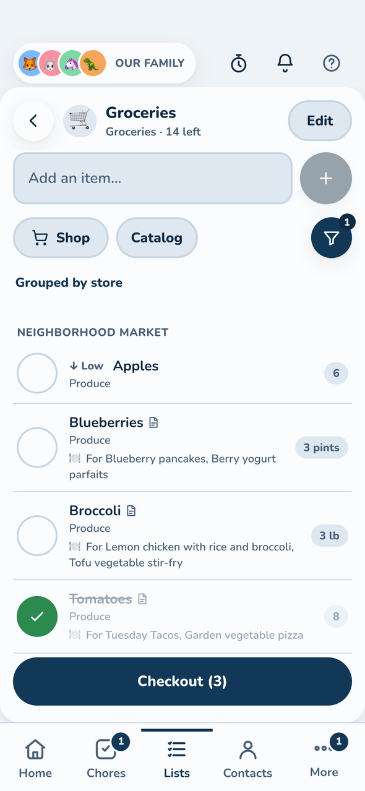
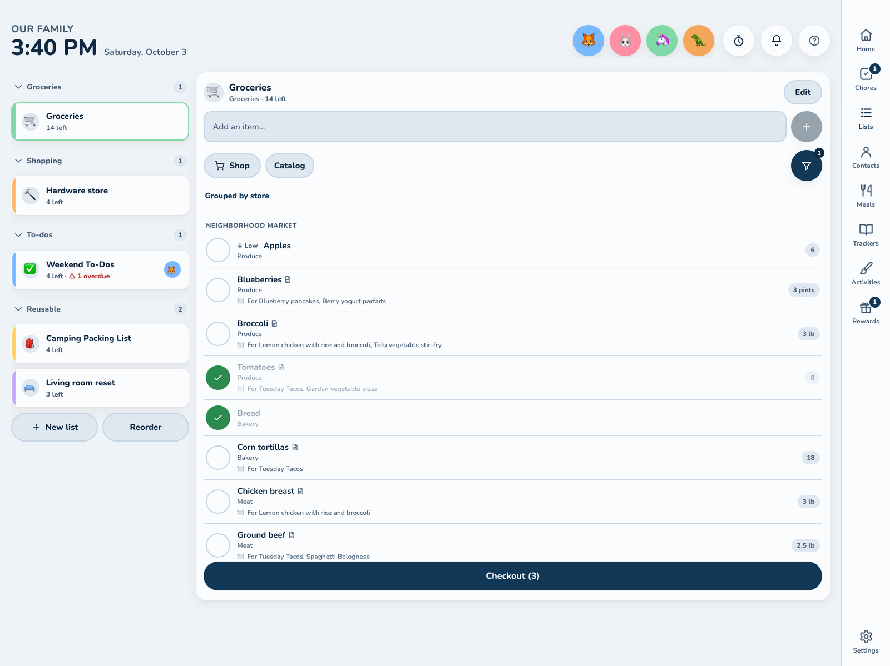

# Lists

  

Don't use lists? An admin can turn off **Lists** in **Settings → General** (tap **Change** under **Features**). It's hidden on every screen; nothing is deleted. See [Features](../settings/general.md#features).

The Lists tab shows your lists and their open-item counts. On the wall display, the open list sits next to them. On a phone, you tap into one. **New list** or **+** creates a list. Press and hold a list card to edit it.

## Organizing lists

The Lists tab groups your lists by type under **Groceries**, **Shopping**, **To-dos** and **Reusable**, in that order, each with how many lists it has. A type with no lists doesn't show. On the wall display and tablets the same sections fill the column beside the open list.

* **Fold a section**: tap its heading. This device remembers which sections are folded; other screens keep their own.
* **Reorder**: tap **Reorder** under the lists (it shows once a section has two or more). Drag a list by its grip, or tap the up and down arrows to move it one place. Holding a dragged list near the top or bottom edge scrolls. Tap **Done** when you're finished.
* The order is the family's: every phone, the wall and the assistant see it, and anywhere else lists appear (the grocery list picker in Meals, the task picker on an event, a chore's checklist picker) follows it. A list moves within its own section; changing its type moves it to that section.
* New lists go to the end of their section. A restored list comes back where it was.

## List types

| Type | For | Extras |
|---|---|---|
| **Groceries** 🧺 | food and household groceries | Items have a **Store**, an **Aisle** and a **Department**. Group by Aisle, Store or None (default Aisle); sorted by Aisle. [Shop](#shopping-at-a-store) walks the list in one store. [Meals](meals.md#adding-to-the-grocery-list) add ingredients here. Uses the **Grocery catalog**. |
| **Shopping** 🛒 | hardware store, department store, gifts | Everything a Groceries list has, with its own **Shopping catalog**. Meals don't add to it. |
| **To-do** | jobs, errands | Items have an assignee (**Assign to**) and a **Due date**. |
| **Reusable** | packing lists, routines | Items have an assignee. **Reset** unticks everything (steps too) so you can use it again. |

You can change a list's type later, in **Edit** → **Type**.

Groceries and Shopping lists work the same way (stores, aisles, shopping mode, Checkout). What differs is what they remember: each type has its own [catalog](#catalogs), so a hammer from the hardware store isn't suggested on the grocery list, and milk isn't suggested at the hardware store. Stores and their aisle orders are shared by both, since a store is the same store whichever list you shop it from.

**Before list types**, every shopping list was one kind with one catalog. When your Kinwall updated, a shopping list became **Groceries** when its name looks like groceries (it has "grocer", "food", "market", "produce" or "pantry" in it, in any case, so "Groceries", "Supermarket" and "Farmers market" all count), when meals were added to it, or when it was your only shopping list; the others became **Shopping**. Everything remembered went to the Grocery catalog, except names that were only on Shopping lists, which went to the Shopping catalog (a name on both kinds of list went to both). Change a list's type in **Edit** if it guessed wrong. A new shopping list made by the assistant or an older app without a type follows the same name rule, and your first shopping list is always Groceries.

A list can also be a chore's **checklist**, so a routine like "Bedtime" has to be ticked off before the chore counts. A reusable checklist resets itself each time the chore is completed. See [Chores → Checklists](chores.md#checklists).

## Editing a list

**Edit** opens **Name**, **Type**, **Keep checked items in place** (see below), **Emoji**, **Color** and **Owners (nobody = whole family)**. On a shopping list it also opens [Stores & departments](#stores--departments). It also has **Archive** (next to delete) and delete, which removes all the list's items too. Archived lists are hidden from the main Lists view and collect in a collapsed **Archived (*N*)** section at the bottom of the list overview. Expand it to **Restore** a list or delete it for good. The API returns them with `GET /api/lists?archived=true`; `PATCH /api/lists/{id} {archived}` archives or restores.

## Adding and ticking items

* Type in the add bar and press Enter. The keyboard stays open for the next item.
* **It remembers where things go** (shopping lists): see [Remembered places](#remembered-places).
* **Suggestions as you type** (shopping lists): see [Autocomplete](#autocomplete).
* Tap the circle to tick an item off. What happens next depends on **Keep checked items in place**:
  * **On** (the default for shopping and reusable lists): the item stays where it is, crossed off and dimmed, so the list doesn't move under your thumb while you shop. Tap it again to untick it. A **Checkout (*N*)** button (**Reset (*N*)** on a reusable list, **Clear checked (*N*)** on a to-do list) sits at the bottom of the list while anything is ticked.
  * **Off** (the default for to-do lists): ticked items move to **Done (*N*)**, which you can expand, with **Clear checked** (or **Reset list** on a reusable list).
* **Checkout** removes the ticked items. **Reset** unticks them for next time instead. Either one shows a short "Checked out 5 items · **Undo**" message; tap **Undo** within a few seconds and nothing changes. Items you tick after tapping Checkout aren't swept up.
* Long titles wrap to two lines on the row (three in icon-first density); the item sheet always shows the whole title.
* A badge before the title shows the item's **Priority** (see below), and a note icon after it means the item has **Notes** or a **Discussion**.
* An item with a due date shows it in small text under the title: "Due today", "Due Fri, Oct 3", or "Overdue · Sep 22" in red. A list with overdue items says so on its card and at the top of the list ("5 left · ⚠ 2 overdue"), so you can see where to look without opening each one. The API returns the count as `overdueCount`.
* Tap an item to edit it: **Title**, **Priority**, **Steps**, **Quantity** ("2, 1 lb, x3"), **Store**, **Aisle** and **Department** (shopping; see [Stores, aisles and departments](#stores-aisles-and-departments)), **Assign to** (to-do and reusable), **Due date** (to-do, with **Clear**), **Linked event**, **Notes** (the item's own description), **Discussion** (see below), and **Order** (**Move up** / **Move down**, manual sort only).

## Stores, aisles and departments

On a shopping list, the item sheet puts **Quantity**, **Store** and **Aisle** first. **Department**, **Priority**, **Linked event** and **Notes** fold into **More** below them; the **More** line shows what's set there ("More · Produce · Notes"), so nothing is hidden. Store, aisle and department are dropdowns of the values your family already uses on any list, plus **None** and **New store…** / **New aisle…** / **New department…**, which opens a text field for a new one.

* **Store** is where you plan to buy the item. **None** means anywhere.
* **Aisle** belongs to a store: "Aisle 4", "Produce", "Back wall". The dropdown offers the chosen store's aisles in the order you walk them, and changing the store clears an aisle that store doesn't have.
* **Department** is the kind of thing it is: "Produce", "Dairy", "Frozen". It's the same for every store. (On the API and to the assistant it's the item's `category`.)
* If an item has no store, the sheet suggests the store it was last bought at ("Last bought at Neighborhood market. **Plan to buy it there**"). It's only a suggestion; nothing changes unless you tap it.

### Departments fill in aisles

When an item has no aisle known at a store (none set for that store and none remembered there), but its department matches one of that store's aisles (ignoring capitals), it goes in that aisle. "Apples" with the department Produce shows under Produce at a store that has a Produce aisle, in **Aisle** sort and grouping and on a [trip](#shopping-at-a-store), with nothing typed. Groceries added from [Meals](meals.md#adding-to-the-grocery-list) come with a department, so they land in the right aisle too.

This is only how the item is shown. The aisle isn't saved, so if the store's aisles change, the item follows. The item sheet shows it under Aisle ("Produce, from its department"). An aisle you set yourself always wins.

### Remembered places

When you save a shopping item with a store, department or aisle, Kinwall remembers it for that item name in the list type's [catalog](#catalogs), on the server, so every phone, the wall and the assistant share it. Next time anyone adds "milk" to a Groceries list (typed, from Meals, or through the assistant), it gets the same store, department and aisle. Anything you set yourself wins, including choosing **None**.

* Names match ignoring capitals, extra spaces and simple plurals: "Eggs" is "egg", "Tomatoes" is "tomato", "Berries" is "berry".
* The aisle is remembered per store. Milk can be in Aisle 4 at one store and on the back wall at another; each store's aisle comes back when the item is planned for that store.
* The memory outlives the item: checking out milk doesn't forget where it goes.
* To see or change everything that's remembered, open the list's [catalog](#catalogs).
* To-do and reusable lists don't use it.

### Autocomplete

On a Groceries or Shopping list, the add bar (and **Add an item** in [Shopping mode](#shopping-mode)) suggests names your family has added before on lists of the same type, from the first letter you type. Type "ba" on the grocery list and you get Bananas, Banana milk, Bagels and so on, the ones you add most first. On Groceries lists, ingredients from your saved recipes are suggested too, after the things you've actually bought.

* Each suggestion shows where it goes, for example "Produce · Market".
* Capitals and simple plurals don't matter: "egg" finds Eggs.
* Things already on the list (and not ticked) aren't suggested.
* Tap a suggestion to add it straight away, with the spelling you used last time and its remembered store, department and aisle. On a keyboard, use ↑ and ↓ to pick one and Enter to add it; Enter with nothing highlighted adds what you typed. Escape closes the suggestions.
* In Shopping mode the suggestions open above the field, clear of the keyboard. With the field empty, **Buy again** offers the six things you add most that aren't on the list.
* Suggestions come with the list, so they work offline too.
* Names are remembered household-wide, on the server, whether you add from the app, from Meals or through the assistant. Renaming an item changes the spelling suggested next time.
* Items from before this update show in simple lowercase (for example "banana milk") until you add them again; the next add keeps your spelling.
* To forget one, open it in the list's [catalog](#catalogs) and tap **Forget this item**. It stops being suggested and where it goes is forgotten; items on lists keep it. (A recipe ingredient still comes back as a suggestion while a saved recipe uses it.)

### Stores & departments

**Edit** → **Stores & departments** (shopping lists) lists every store, department and aisle your family uses:

* **Rename** changes the name everywhere: items on every list and what's remembered. Rename "Costco" to "Warehouse club" once and every item follows. Stores and aisles are shared by Groceries and Shopping lists; a department is renamed only in this list type's catalog (and on lists of this type).
* The trash button **removes** a name: it's cleared from every item that uses it and forgotten.
* **Items**: **Open the grocery catalog** (or **Open the shopping catalog** on a Shopping list; see [Catalogs](#catalogs)).
* **Aisles**: pick a store, then drag its aisles into the order you walk the store, for example Produce, Bakery, Deli, Meat, Aisle 3 to Aisle 18 with Frozen in the middle, Dairy, Pharmacy. Aisles don't have to be numbers, and one no item uses yet can be added here so it's in the dropdown. **Aisle** sort and grouping follow this order; aisles you haven't placed come after, in natural order.

### Catalogs

Each shopping list type has its own catalog: the **Grocery catalog** for Groceries lists and the **Shopping catalog** for Shopping lists. Tap **Catalog** on a list to open its type's catalog and see everything your family has bought before on lists of that type, A to Z, with its department, its categories (🏷️), how many times it was bought, and where it's found at each store ("Warehouse club · Aisle 12", "Neighborhood market · Dairy").

* **Find an item** searches names; capitals and simple plurals don't matter.
* **Filter & sort** opens a sheet with everything that narrows or orders the list. Changes show in the catalog behind it right away; tap **Done** when you're finished. The button shows how many filters are on (**2**, say).
  * **Store** (**All stores**, then each store) shows only what's found at that store.
  * **Category** (**All categories**, then each category with how many items are in it) shows only that category.
  * **Department** (**All departments**, then each department with its count) shows only that department.
  * **Sort**: **A–Z**, **Most bought**, **Department**, **Aisle at** the store (with a store picked, in the order you walk it; items not found there go last) or **Recently used**.
  * **Group by**: **Department** or **Category**, with a heading and count for each. An item in several categories is listed under each one; items with none are under **No department** or **No category** at the end.
  * **Reset** clears the filters and goes back to A–Z with no grouping.
  * **Edit categories** (on a parent's device) renames or removes a category on every item that has it.
  * Sort and grouping are kept on this device. Search, store, category and department all apply together.
* While a filter is on, one line above the items sums it up ("Neighborhood market · Breakfast · Most bought"). Tap it to change the filters, or tap **Clear** to show everything again.
* **+** adds it to the list you opened the catalog from, with its remembered store, department and aisle. With a store picked, it's planned for that store. Things already on the list show **On list** instead.
* Tap an item to edit it: its **Name** (a respelling, or a new name), its **Department**, its **Categories**, and its **Stores**, each with the aisle it's in there (**Not known** when you don't know yet). **Add a store** adds another; the trash button next to a store forgets it there. **Save** keeps the changes, and the next time anyone adds it to a list it lands in the right aisle. An aisle you type here shows up in that store's aisle picker, like one saved on an item.
* **Categories** are your family's own groupings, apart from the store department: Breakfast, Snacks, Lunchbox, Pantry staples, Cleaning, Baby, Pet, or anything you like. An item can have up to 10. Tap a category chip to add or remove it, or type a **New category** (your family's categories are suggested as you type) and tap **Add**. Until your family has any, a few starters are offered; none are added unless you tap them. Capitals don't matter: "snacks" joins Snacks.
* **New** adds something to the catalog without putting it on a list, so it's suggested and lands in the right aisle the first time.
* **Forget this item**, at the bottom of an item, removes it from the catalog (see [Autocomplete](#autocomplete)).
* Wall screens and kids' devices can browse and edit the catalog, including categories, like they edit list items; forgetting an item needs a parent's device.

## Shopping at a store

Under **Add an item**, **Shop** starts a trip and opens [shopping mode](#shopping-mode). It asks **Where are you shopping?** with your stores and **Any store**; if your family has only one store (or none yet), it starts right away there (or at any store). The trip is kept on this device only (the wall and other phones aren't affected) and ends at **Checkout**, or when you tap **End**.

While a trip is on, the list shows **Shopping at** the store and how many items are left in place of **Shop**. Tap it to go back to shopping mode, or tap **End** next to it to stop shopping without checking out.

During a trip:

* Items planned for this store, or for anywhere, are listed by their aisle **at this store**, in the order you walk it. An item planned for anywhere shows the aisle it was in last time you shopped here.
* An item with no aisle known here goes in the aisle named like its department, if the store has one (see [Departments fill in aisles](#departments-fill-in-aisles)).
* Items with no aisle known at this store are in **Aisle unknown** at the end.
* Items planned for another store are in a dimmed **At other stores** section at the bottom. You can still tick them.
* Ticked items stay crossed off in place, whatever the list's setting.
* Setting an item's aisle in the item sheet saves it for this store. An item planned for anywhere gets the aisle and stays "anywhere".
* **Checkout (*N*)** removes the ticked items, remembers this store as where they were last bought, and ends the trip. **Undo** brings everything back, trip included. If anything wasn't ticked, the message says so: "Checked out 9 items. 3 left for next time."
* **Didn't find these?** When a trip at one store ends with items still unticked, Checkout first lists them, each with a store picker (your stores, **New store…** or **Anywhere**). Pick another store for any you'll get elsewhere and tap **Move**, or tap **Leave them as they are**. Either way Checkout goes ahead, and **Undo** still undoes it (moved items stay moved). A moved item shows under **At other stores** next time you shop here. **Any store** trips skip this step.

The **View** button (grouping, sort, store) is hidden during a trip, since the store's aisle order is the order.

You can also shop at **Any store**: nothing is tied to one store's layout, so the list goes store by store, each in its own aisle order.

## Shopping mode

Shopping mode is the list and nothing else, for your phone in the store: no header, no tab bar, no list settings.

* Tap **Shop** on a shopping list and pick the store (or **Any store**); with only one store it starts there straight away.
* The top bar shows the list name, the store (tap it to change stores), how many items are left, and **Done**.
* Items are grouped by aisle in walking order, with **Aisle unknown** and a dimmed **At other stores** at the end, just like a trip. Tap anywhere on a row to tick it; it stays crossed off in place. Quantities and the first line of an item's notes show on the row.
* Came in the other end? Tap **⇅** in the top bar to walk the aisles in reverse. The aisles flip right away, whether they follow the store's aisle order or natural order; items inside an aisle keep their order, and **Aisle unknown** and **At other stores** stay at the end. A **Reversed** tag shows under the count while it's on, and the Live Activity's next items follow it. It's remembered for that store on this device only, so next time you shop there it's still reversed; tap **⇅** again to switch back. The store's aisle order isn't changed. At **Any store** there's no one layout to reverse, so the button isn't shown.
* Remembered something in the store? Tap **+** at the bottom to open **Add an item**.
* **Checkout (*N*)** at the bottom removes the ticked items, ends the trip and closes shopping mode. **Undo** brings it all back, including shopping mode. Anything left unticked gets the same [Didn't find these?](#shopping-at-a-store) step first.
* **Done** (or Escape on a keyboard) closes shopping mode but keeps the trip: ticked items stay crossed off and the store stays picked. The list then shows **Shopping at** the store with how many items are left; tap it to go back where you were. Items you add to the list in the meantime show up in shopping mode right away.
* Only **Checkout**, or **End** on the list, ends the trip.
* The screen stays on while shopping mode is open, and a wall screen doesn't drift back to the calendar.
* If the app or browser closes mid-trip, opening Kinwall again takes you straight back to shopping mode on this device.
* A link to `#/lists/<list id>/shop` opens a list straight in shopping mode.
* Add `?store=<store name>` (`#/lists/<list id>/shop?store=Market`) to start the trip at that store without asking **Where are you shopping?**. The name matches one of the list's stores in any case; `any` means **Any store**. A store that isn't one of the list's asks as usual.
* In the Kinwall app for iPhone, a trip is also a Live Activity on the Lock Screen and in the Dynamic Island: "Shaws · 5 left · next: Dairy" and the next item, in the store's walking order. **Got it** ticks that item right there, and **Open** opens shopping mode. It follows along as you tick items in the app, and ends at **Checkout** or **End**.

## Offline shopping

Kinwall keeps working in a store with one bar of signal or none:

* **Open it and see your list.** A phone that has opened Kinwall before starts up without a connection and shows the lists as they were when it last reached your server. If the connection is only slow, Kinwall shows that copy after a few seconds rather than a spinner.
* **Tick items off, add items, edit them or delete them.** Changes show at once and wait on the phone, even if you close Kinwall or the phone restarts. While you're offline, a crossed-out cloud appears in the header next to the bell, with the number of changes waiting. Tap it for a reminder of what that means. Items changed on this phone and not synced yet have a dashed circle.
* **They sync on their own** when the connection returns: as soon as the phone is back online, when you switch back to Kinwall, and every 15 seconds while changes are waiting. The cloud disappears once everything is on the server.
* **Chore ticks** work the same way on the Chores tab.
* **Everything else needs a connection.** Creating or editing lists, steps, reordering, **Clear checked**, events and settings say "You're offline. This will work when you're back online." instead of failing. Nothing is lost: try again once you're back.

**Checkout** needs a connection too; if it can't reach the server, Kinwall says so and your ticked items stay ticked.

**When two people change the same list.** Changes replay in the order you made them, and each one only touches what you changed. If Sam ticks **Milk** in the store while Alex adds "2 gallons" to its notes at home, both stick. If you both change the same thing (say Alex unticks **Bread** after Sam ticked it offline), the change that reaches the server last wins. If Alex deletes an item that Sam then edits offline, Sam's edit is dropped when Sam comes back online, and Kinwall says so. An item added offline is never added twice, even if the connection drops mid-sync.

Signing out or unpairing a device deletes its offline copy and anything still waiting to sync. In the Kinwall app, see [Offline in the Kinwall app](../getting-started/put-it-on-the-wall.md#offline).

## Priority

Each item has a **Priority**: Low, Normal, High or Urgent. Pick it in the item sheet.

| Priority | On the row | Order |
|---|---|---|
| **Urgent** | a red **‼ Urgent** badge and a red bar down the left edge | first |
| **High** | an orange **! High** badge | after urgent |
| **Normal** | nothing | after high |
| **Low** | a muted **↓ Low** | last |

Each mark has its own shape and word, so priority never depends on telling red from orange. The same badges show in the item sheet's Priority picker, on the Board's **Due soon**, on a person's day and in an event's **Tasks**. Screen readers hear the priority with the item ("Urgent priority"). Open items that are overdue move to the top of their priority. Done items drop their priority boost. In the [daily summary](notifications.md#daily-summary), urgent items are marked ‼️ and high ones ⭐.

## Sorting

**View** (the filter button next to **Shop** on a shopping list, or next to **+** on other lists) opens **Group by** (shopping lists), **Sort** and **Show store** (shopping lists with stores). Group and sort are saved on the list, so every screen shows the same order; the store you show is just for this screen. **Reset** goes back to a new list's grouping and sort, and all stores.

When anything differs from a new list of that kind (grouped by aisle and sorted by aisle for shopping, not grouped and in your order for the rest), the button shows how many settings are changed, and one line under it sums them up, for example "Grouped by store · Neighborhood market only". Tap the line to change them. The button is hidden while a list is empty.

**Sort** picks how a list's items are ordered.

| Sort | Order |
|---|---|
| **Manual** (default) | By priority, overdue items first within each, then your own drag order. |
| **Date added** | Newest first. |
| **Due date** | Soonest first. Items with no due date go last. |
| **Priority** | By priority, overdue first, then soonest due date. |
| **A–Z** | Alphabetical, ignoring capital letters. |
| **Aisle** (shopping lists; the default for new ones) | By store, then aisle in the store's walking order (natural order, "Aisle 2" before "Aisle 10", if you haven't set one), items with no aisle last, then A–Z. |

Groups (store, category or aisle) still come first; the sort applies inside each group. With **Keep checked items in place** on, ticking an item never moves it. Dragging only works in **Manual**. In the other sorts, the grip is dimmed and tapping it says "Switch to Manual to drag".

The server sorts the same way, so `GET /api/lists/{id}` and MCP's `get_list` return items in the list's order.

## Steps

Break a bigger job into steps ("Tidy the living room": fold blankets, fluff cushions, find the remote). In the item sheet, type in **Add a step…** and press Enter.

* The row shows progress under the title ("2 of 5") with a thin bar.
* Tick steps in the sheet. Ticking the last open step ticks the item itself. Unticking a step on a done item opens the item again.
* Ticking the item ticks all its steps; unticking it unticks them all.
* Reorder steps by dragging the grip, or focus the grip and press Alt+Up / Alt+Down. The trash button deletes a step.
* **One at a time** shows only the next open step, big, with a **Done → next** button. Handy for kids working through a routine on the wall. Each step is announced to screen readers as it's done.
* **Reset list** on a reusable list unticks every step as well.

## Groups and order

* On shopping lists, **View** → **Group by** switches between Store, Aisle and None. **Aisle** groups are per store ("Neighborhood market · Produce"), in store order and then the store's aisle order; an item with no aisle groups under its department's aisle when the store has one. **Reorder stores** (under Group by) lets you arrange the store groups in the order you shop them, then **Save order**. Shopping lists don't group by department: the department fills in the aisle instead, and a list grouped by category from before switches to Aisle.
* Items added from [Meals](meals.md#adding-to-the-grocery-list) show which meals they're for ("For Taco night").
* **View** → **Show store** shows one store at a time (items with no store stay), or **All stores**.
* **Drag** an item by its grip to reorder it within its group (Manual sort only). Other groups and done items keep their places. The keyboard alternative is Move up / Move down in the item sheet.

## Linking items to events

Give an item a **Linked event** (picked from the next 30 days) and it becomes a task for that event:

* the list row shows the event's date and title,
* the event's detail sheet lists it under **Tasks**, where you can tick it off or add more ([Events → Linked tasks](events.md#linked-tasks)),
* the morning [daily summary](notifications.md#daily-summary) shows "To do for today's events".

Separately, open items **due today** on any list get a short "Due today" line in the daily summary.

A recurring local event links by its series, so the task follows every occurrence.

## Discussion

Below the item's **Notes** field, **Discussion** is a thread of notes from the family, each with the poster's avatar and name in their color ("Remote was under the cushion again"). It works exactly like [notes on events](events.md#notes): **+ Add note**, **Post as** a member (or **Someone**), tap a note to edit or delete it. The item's own **Notes** field stays a single description; the discussion is for separate back-and-forth.

Deleting an item (or clearing checked items, or deleting the list) deletes its discussion. Export and import include it.

## Notifications

Devices with **List updates** on get "List updated — *Groceries* has new items" when items are added. This is limited to one notification per list every 10 minutes. See [Notifications](notifications.md).

## API and MCP

* `GET/POST /api/lists`, `GET/PATCH/DELETE /api/lists/{id}` (lists carry `sortBy`: `manual`, `added`, `due`, `priority`, `alpha` or `aisle`; `groupBy`: `store`, `category`, `aisle` or `none`, where a shopping list reads `category` as `aisle`; and `keepChecked`, which defaults by kind), `POST /api/lists/{id}/items` (one item or an array; `priority` and `steps: string[]` are optional; an optional client-made UUID `id` makes a retried add safe: an id already on that list returns the existing item, one used on another list is a `409`), `PATCH/DELETE /api/lists/{id}/items/{itemId}`, `POST /api/lists/{id}/clear-completed`, `POST /api/lists/{id}/reset`, `POST /api/lists/{id}/reorder`, `PUT /api/lists/{id}/groups`, `GET /api/events/{id}/items`.
* `PUT /api/lists/order` `{ids}` sets the family's list order (`sort` is the position). Lists left out, archived ones included, keep their order after the given ones; an unknown or repeated id is a `400`. `GET /api/lists` returns lists in this order. New lists go last.
* Shopping: items carry `aisle`. On a shopping list, `POST …/items` fills an omitted `store`, `category` or `aisle` from what's remembered for the name (an explicit value or `null` wins), and saving an item remembers it. `GET /api/lists/{id}` returns `suggestions` (on a shopping list: `stores`, `categories`, `aisles: [{store, aisle}]`, and `items: [{title, key, uses, category?, place?: {store, aisle}}]`, up to 300 names to autocomplete, most used first, then recipe ingredients with `uses` 0; `place` is at `?store=` when given, else the newest store), `DELETE /api/lists/remembered/{key}` forgets one (admin), `aisleOrder: [{store, aisles}]`, and on each shopping item `places: [{store, aisle}]` (where it's been kept, newest first) and `meals` (the planned meals it was added for). `?store=<name>` adds `trip`: the list as shopped there, `items: [{id, title, quantity, done, store, aisle, section}]` with `section` `aisle`, `unknown` or `other`. An item with no aisle known there whose `category` (department) matches one of the store's aisles, ignoring case, gets that aisle in `trip` only; nothing is saved.
* **Changed (2026-09-30):** `suggestions` is filled only for shopping lists. To-do and reusable lists return empty `stores`, `categories` and `aisles` (and no `items`), since nothing there uses them. `?suggestions=false` also leaves them (and each item's `places`) out of a shopping list: a cheaper read for clients that only show the items, like Home Assistant.
* Each list in `GET /api/lists` (and the detail's `list`) carries `itemsRev`, a number that goes up whenever that list's items or their steps change. Compare it to skip refetching a list that hasn't changed.
* `clear-completed` and `reset` take an optional body `{itemIds, store}`: only those items (if still ticked), and for Checkout the store they were bought at. `PATCH` an item with `{aisle, aisleStore}` to set its aisle at a store it isn't planned for (a trip).
* `POST /api/lists/values` `{field: "store" | "category" | "aisle", from, to, store?}` renames (`to`) or removes (`to: null`) a value everywhere; an aisle needs its `store`. `PUT /api/lists/aisles` `{store, aisles}` sets a store's aisle order (`[]` clears it).
* Items carry `priority` (`low`, `normal`, `high` or `urgent`; older clients sending `high` keep working), `steps` (`[{id, title, done, sort}]`, in order), `stepsDone` and `stepsTotal`.
* Steps: `POST /api/lists/{id}/items/{itemId}/steps` (`{title}`), `PATCH …/steps/{stepId}` (`title`, `done`, `sort`), `DELETE …/steps/{stepId}`, `POST …/steps/reorder` (`{stepIds}`). Each returns the whole updated item, including any automatic complete or re-open.
* List types: a shopping list's `catalog` is its type, `groceries` or `shopping` (`null` on to-do and reusable lists); `kind` stays `shopping` for both, so older apps keep working. `POST /api/lists` and `PATCH /api/lists/{id}` take `catalog`. Without one, a new shopping list is `groceries` when its name looks like groceries or the family has no Groceries list yet, else `shopping`, and a list switched to shopping keeps its type or takes the same rule.
* **Changed (2026-09-30):** remembered places, names, categories and autocomplete are per catalog. `GET /api/lists/{id}` suggests what's remembered from lists of the same type (and recipe ingredients on Groceries lists only), and adds fill from and remember into that catalog. Every catalog route takes `?catalog=groceries|shopping`, `groceries` when left out. `POST /api/lists/values` takes `catalog` to rename a department in one catalog only; stores and aisles are shared. Meals add ingredients to Groceries lists only.
* Catalogs: `GET /api/lists/remembered` (`?catalog=`, `?q=` searches names, `?store=` keeps items found there, `?tag=` keeps items in that category, ignoring case; they combine) returns every remembered item by title: `{key, title, uses, lastUsed, category, places: [{store, aisle, updatedAt}], lastStore, tags}` (`lastStore`: where a new add goes; `tags`: its categories, in order). `PUT /api/lists/remembered/{key}` edits one: `title` (a respelling; a different name moves it to that name's key, `409` if that's another item), `category` (its department), `tags` (replaces its categories: up to 10, 40 characters each, trimmed, each once ignoring case; a category another item already has keeps that spelling; `[]` clears them; a new name carries them along) and `places: [{store, aisle}]`, which replaces its stores (stores left out are forgotten). Only given fields change. `POST /api/lists/remembered` adds one (`title`, `category`, `tags`, `places`) without putting it on a list; `409` if it's already there. `PATCH /api/lists/remembered-tags` `{from, to}` renames a category on every item in the catalog (`from` ignores case; an item that already has `to` keeps one), `to: null` removes it; it returns `{updated}`, the items changed. Display keys can read, add and edit items, including their categories; renaming or removing a category everywhere and forgetting an item are admin only (forgetting also forgets its categories).
* MCP: `list_lists`, `create_list` and `update_list` (`kind` `groceries`, `shopping`, `todo` or `reusable`; `update_list` also takes `sortBy`, `groupBy` and `keepChecked`), `get_list` (with `store` for the trip view), `add_list_items` and `update_list_item` (both with `aisle`; adds use the remembered places), `set_store_aisle_order`, `list_remembered_items` (with `tag`) and `update_remembered_item` (with `tags`) (the catalogs, each with `catalog`: `groceries`, the default, or `shopping`), `set_list_item_done`, `set_step_done`, `get_event_items`. Lists can be referred to by name.
* Discussion: `GET /api/notes?target=list_item:<id>`, `POST /api/notes` `{target, body, memberId?}`, `PATCH/DELETE /api/notes/{id}`; items in `GET /api/lists/{id}` carry `noteCount`. MCP: `list_notes`, `add_note`, `update_note`.
* Display keys have full access to lists, steps and discussions included.
* Export and import include each list's sort, type (`catalog`) and **Keep checked items in place**, each item's priority, aisle and steps, the remembered places, the remembered item names, the catalog categories (`itemTags`, added to an item's categories on import), each with its `catalog`, and each store's aisle order. Older export files import with Manual sort, the kind's default for keeping checked items, and the [name rule](#list-types) for list types and catalogs.
