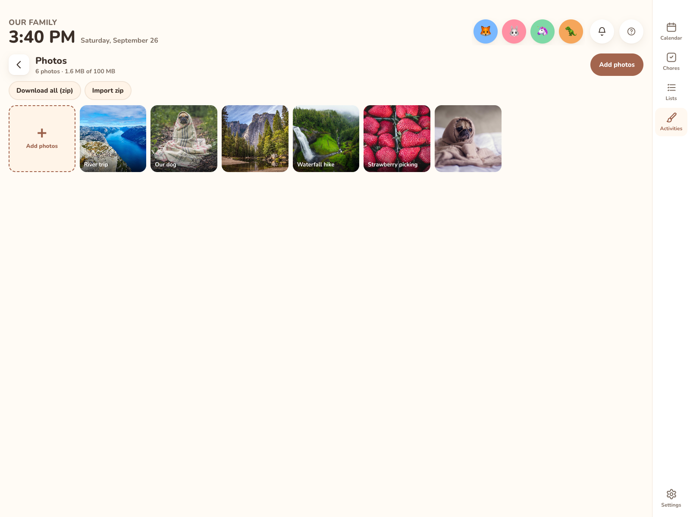
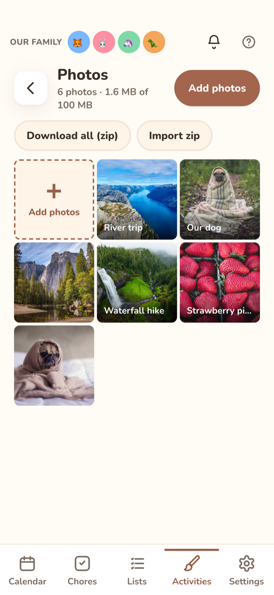

# Photos

**Activities → Photos** keeps a small album of family pictures. They show up on the calendar's [Board view](calendar.md#board-view) picture card and, if you choose, in a display's [quiet-hours screensaver](quiet-hours.md#screensaver).

An admin can turn off **Photos** in **Settings → General → Features**: Activities → Photos and the Board's picture card are hidden, the photos are kept, and a night screen set to **Family photos** shows nature pictures instead. See [Features](../settings/general.md#features).

## Adding photos

Tap **Add photos** (the button at the top, or the **Add photos** tile at the start of the grid) and pick one or more pictures. On an iPhone or iPad this opens your Photos library.

Before uploading, your browser shrinks each photo to at most 1280 pixels on its long edge and saves it as WebP (or JPEG on browsers that can't make WebP). A typical phone photo ends up around 150–300 KB. The original stays on your device.

Adding photos from the Photos page, and captioning and deleting them, needs a parent (admin) sign-in. A paired wall display can look at the photos but not change them.

The one exception is [Paint](activities.md): its **♥ Save to family photos** button adds the drawing here, and it works on wall displays too. The photo is captioned with the drawing's name and who drew it. Only a parent can edit or delete it afterward.

## Captions and owners

Tap a photo to see it full size. Swipe, tap **‹** and **›**, or use the arrow keys to move to the previous or next photo. A parent can also:

* add or edit a **caption** (shown under the picture on the Board and the screensaver),
* mark who it's **for**, or leave it for **Everyone**,
* **Delete** it after you confirm.

## Limits

| Limit | Value |
|---|---|
| One photo, after shrinking | 600 KB |
| Photos per family | 200 |
| Total storage | 100 MB |

The Photos page shows how much you've used, for example "23 photos · 6 MB of 100 MB".

## Formats

JPEG, PNG, WebP and anything else your browser can open. HEIC photos straight from an iPhone's files may not open in every browser. If you see "This photo format can't be read here", pick the photo from the Photos library instead (the iPhone converts it for you) or export it as JPEG first.

## Where photos show up

* **Board view**: the picture card rotates through this display's screensaver sources. If none are chosen, it shows your family photos (or nature photos until you add some).
* **Screensaver**: turn on **Family photos** in **Settings → General → Night screen → During quiet hours show**.

## Backing up and moving photos

Photos aren't part of the JSON [export](../your-data/export-import.md). They back up as their own zip:

* **Download all (zip)** saves `kinwall-photos-YYYY-MM-DD.zip`. It has a `photos/` folder, with each file named by the date it was added and its ID, plus `manifest.json` listing every photo's caption, owner, size and date.
* **Import zip** adds the photos from such a zip to this family. Captions and owners come back from `manifest.json`. An owner is matched by member ID, or else by name, so photos land on the right person in a new family too. Photos already here (same ID) are skipped, so importing the same zip twice doesn't double anything. The per-photo and storage limits still apply, and anything over them is skipped. A zip you unpacked and zipped again with another tool still imports.

Both buttons are on the Photos page and need a parent (admin) sign-in.

API: `GET /api/photos/export.zip`, `POST /api/photos/import` with the zip as the body (`Content-Type: application/zip`).

## Privacy

Photos are stored in your Kinwall database, next to the rest of your family's data, and are only served to your own signed-in devices. They're never sent to any other service. They aren't in the JSON [export file](../your-data/export-import.md). Use **Download all (zip)** to keep a copy (see above), or back up the database itself (see [Backups](../your-data/backups.md)).

API: see [REST API](../integrations/rest-api.md) (`/api/photos`).
