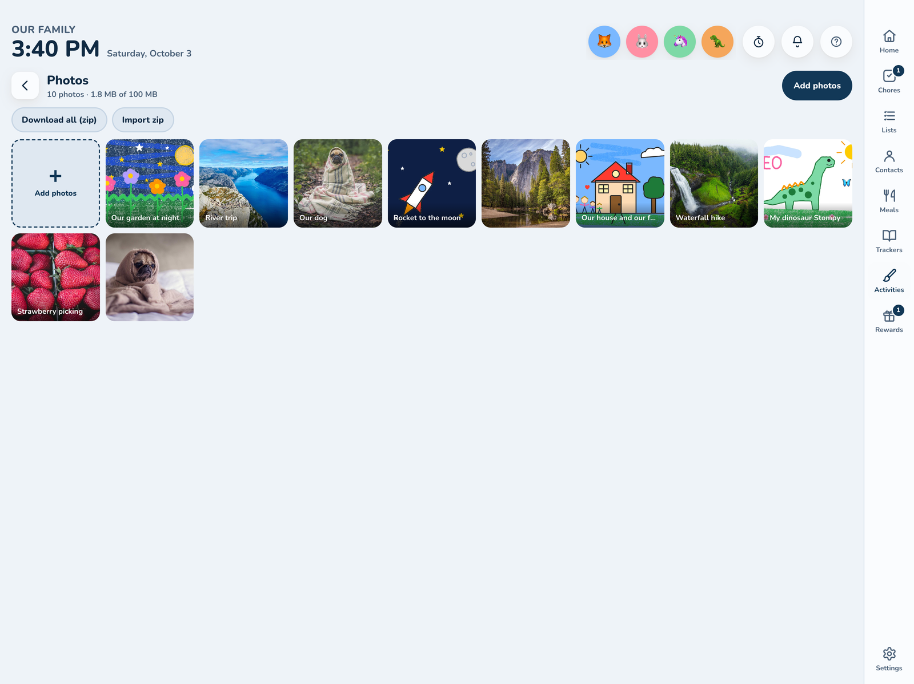
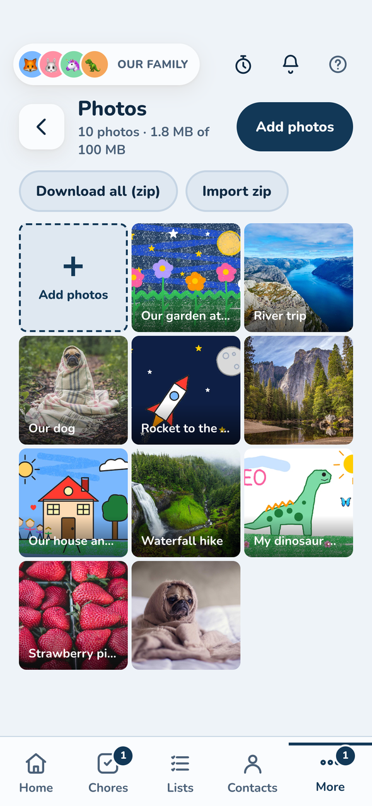

# Photos

**Activities → Photos** keeps a small album of family pictures. They show up on the calendar's [Board view](calendar.md#board-view) picture card and, if you choose, in a display's [quiet-hours screensaver](quiet-hours.md#screensaver).

An admin can turn off **Photos** in **Settings → General** (tap **Change** under **Features**): Activities → Photos and the Board's picture card are hidden, the photos are kept, and a night screen set to **Family photos** shows nature pictures instead. See [Features](../settings/general.md#features).

A [memory](trackers.md#memories)'s own photo isn't a family photo unless its **Also in family photos** switch is on. Until then it shows only in that memory, and the count here lists it separately ("+3 in memories").

## Adding photos

Tap **Add photos** (the button at the top, or the **Add photos** tile at the start of the grid) and pick one or more pictures. On an iPhone or iPad this opens your Photos library.

Before uploading, your browser shrinks each photo to at most 1280 pixels on its long edge and saves it as WebP (or JPEG on browsers that can't make WebP). A typical phone photo ends up around 150–300 KB. The original stays on your device.

Adding photos from the Photos page, and captioning and deleting them, needs a parent (admin) sign-in. A paired wall display can look at the photos but not change them.

The one exception is [Paint](activities.md): its **♥ Save to family photos** button adds the drawing here, and it works on wall displays too. The photo is captioned with the drawing's name and who drew it. Only a parent can edit or delete it afterward.

## Captions and owners

Tap a photo to see it full size. Swipe, tap **‹** and **›**, or use the arrow keys to move to the previous or next photo. A parent can also:

* add or edit a **caption** (shown under the picture on the Board and the screensaver),
* mark who it's **for**, or leave it for **Everyone**,
* **Delete** it after you confirm.

## Limits

| Limit | Value |
|---|---|
| One photo, after shrinking | 600 KB |
| Photos per family | 200 |
| Total storage | 100 MB |

The Photos page shows how much you've used, for example "23 photos · 6 MB of 100 MB".

## Formats

JPEG, PNG, WebP and anything else your browser can open. HEIC photos straight from an iPhone's files may not open in every browser. If you see "This photo format can't be read here", pick the photo from the Photos library instead (the iPhone converts it for you) or export it as JPEG first.

## Where photos show up

* **Board view**: the picture card rotates through this display's screensaver sources. If none are chosen, it shows your family photos and [Google Photos](#google-photos) when it's connected (or nature photos until there are some).
* **Screensaver**: turn on **Family photos** under **During quiet hours show** (**Settings → General**, tap **Change** under **Night screen**).

## Google Photos

> **Not available yet.** Google only lets accepted Photos partners use the Ambient API that this needs (Google answers other apps with "permission denied" and points to its partner program), and a self-hosted server can't be a partner. So Google Photos is switched off; it only appears on a server with `GOOGLE_PHOTOS_ENABLED=1` and a partner-approved Google project. Add [family photos](#adding-photos) instead.

A parent can also show albums from Google Photos on the Night screen and the Board's picture card, without copying them into Kinwall. The photos stay in Google Photos; Kinwall keeps only which ones to show.

**Connect it** from a parent device: **Settings → General**, tap **Change** under **Night screen**, then **Connect Google Photos** at the bottom of the sheet.

1. Sign in to the Google account whose photos you want. Google asks for permission to show the photos you pick on a device. That's its own permission: it doesn't use or change your [Google Calendar](../calendars/google.md) connection, and connecting Calendar never asks for Photos.
   * Usually Google's sign-in opens in the same tab, like connecting a calendar, and brings you back to this sheet. On a wall screen the sheet shows a QR code instead: scan it and sign in on your phone (or tap **Continue to Google**).
   * If your server uses a [TV client](../self-hosting/configuration.md#google-photos), Kinwall shows a short code instead: on a phone or computer, go to `google.com/device` (the link, or the QR code on a big screen) and enter it.
2. Pick albums for "Our Family Kinwall" (your family's name): tap **Choose albums in Google Photos** (or scan its QR code). With the code sign-in, Google usually opens this page for you. The sheet says "Waiting for you to choose albums…" until you're done.
3. Once albums are picked, the sheet says how many photos there are, and **Google Photos** appears under **During quiet hours show**. Turn it on for each display that should show them. The Board's picture card shows them on displays that haven't picked any sources.

It's one connection for the whole family: every screen can show the photos, but only a parent device can connect, change albums or disconnect. Wall screens and kids' devices can't.

* **Change albums** opens the same Google Photos page to pick different albums. New picks show up within the hour.
* **Disconnect Google Photos** removes Kinwall from the Google Photos device list, cancels its permission and forgets the list of photos. Your photos and Google Calendar aren't touched. You can also remove access in your Google Account under **Security → Third-party apps & services**.
* **"Google didn't allow Photos with this app."** Google turned down the Photos permission for the server's Google app. The person who runs the server can switch to a TV client: see [Google Photos](../self-hosting/configuration.md#google-photos) in Configuration.
* **Reconnect.** If Google stops sharing (you removed the permission in your Google Account, or deleted the device in Google Photos), screens quietly go back to their other picks (nature pictures if Google Photos was the only one), and the sheet shows **Reconnect Google Photos** to parents.
* Google Photos leaves out screenshots, receipts, blurry shots and pictures it considers too personal for a shared screen. Kinwall shows photos only and skips videos.
* There are no webhooks or MCP tools for Google Photos: it only picks pictures for screens.

The [demo](../self-hosting/demo-build.md) has a pretend Google Photos connection with sample pictures, so you can see the sheet and the slideshow without Google.

**Self-hosting?** The server needs its own Google Cloud project with the Photos Ambient API turned on. See [Google Photos](../self-hosting/configuration.md#google-photos) in Configuration.

What Google sees and what's stored: see [Privacy](../your-data/privacy.md#google-photos).

## Backing up and moving photos

Photos aren't part of the JSON [export](../your-data/export-import.md). They back up as their own zip:

* **Download all (zip)** saves `kinwall-photos-YYYY-MM-DD.zip`. It has a `photos/` folder, with each file named by the date it was added and its ID, plus `manifest.json` listing every photo's caption, owner, size and date.
* **Import zip** adds the photos from such a zip to this family. Captions and owners come back from `manifest.json`. An owner is matched by member ID, or else by name, so photos land on the right person in a new family too. Photos already here (same ID) are skipped, so importing the same zip twice doesn't double anything. The per-photo and storage limits still apply, and anything over them is skipped. A zip you unpacked and zipped again with another tool still imports.

Both buttons are on the Photos page and need a parent (admin) sign-in.

API: `GET /api/photos/export.zip`, `POST /api/photos/import` with the zip as the body (`Content-Type: application/zip`).

## Privacy

Photos are stored in your Kinwall database, next to the rest of your family's data, and are only served to your own signed-in devices. They're never sent to any other service. They aren't in the JSON [export file](../your-data/export-import.md). Use **Download all (zip)** to keep a copy (see above), or back up the database itself (see [Backups](../your-data/backups.md)).

API: see [REST API](../integrations/rest-api.md) (`/api/photos`).
